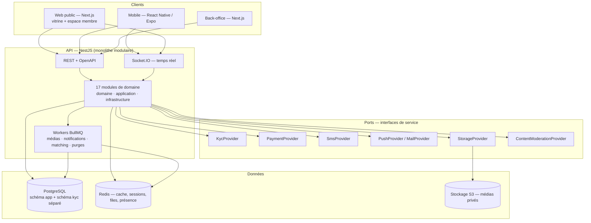

# Phase A — Audit et cadrage

**Produit :** « À Chacun Une Belle Âme » — plateforme SaaS de rencontres sérieuses réservée aux personnes majeures
**Document :** cadrage technique et produit, en prolongement du _Cahier des charges fonctionnel & technique v1.0_
**Statut :** proposition d'équipe technique — à valider par le porteur de projet
**Date :** août 2026

> Ce document ne contient volontairement aucun code. Il fixe le périmètre, les hypothèses, les risques et le plan
> d'exécution. La conception détaillée (architecture, schéma de données, API, backlog) fait l'objet de la Phase B.

---

## 1. Compréhension du produit

### 1.1 Reformulation

« À Chacun Une Belle Âme » n'est pas une application de rencontres de plus. C'est **l'industrialisation d'une
communauté qui existe déjà** : plus de 9 000 personnes réunies dans un groupe WhatsApp autour d'une intention
commune, la relation amoureuse sérieuse.

Le produit à construire remplace un canal non structuré (un fil unique, aucun profil, aucune vérification, aucune
modération individuelle, aucun modèle économique) par une plateforme où :

- chaque membre est **majeur, réel et vérifié** avant d'accéder pleinement au service ;
- chaque membre dispose d'un **profil structuré et modéré** (photos, valeurs, intentions, critères) ;
- la mise en relation passe par un **algorithme explicable** et non par le hasard d'un fil de discussion ;
- **la messagerie ne s'ouvre qu'après consentement mutuel**, ce qui supprime par construction la sollicitation
  non désirée — le principal grief des utilisatrices sur ce type de service ;
- la **confiance est le produit** : modération, signalement, blocage et détection d'arnaque sentimentale sont
  des fonctions de premier rang, livrées dès le MVP et non ajoutées après coup ;
- la valeur créée est **monétisable** par un modèle freemium adapté aux moyens de paiement locaux.

Le point de départ n'est pas une audience à conquérir mais un actif à convertir. Cela change deux choses dans la
construction : le MVP doit être **prêt à recevoir un pic d'inscriptions dès l'ouverture** (et non à croître
lentement), et le **parcours de migration doit être traçable** campagne par campagne pour piloter la conversion.

### 1.2 Contraintes de contexte qui structurent tout le reste

| Contrainte                                           | Conséquence produit / technique directe                                                                                             |
| ---------------------------------------------------- | ----------------------------------------------------------------------------------------------------------------------------------- |
| Marchés Cameroun, Bénin, Côte d'Ivoire               | Paiement **mobile money d'abord**, carte en second. Devises **XAF / XOF sans sous-unité**.                                          |
| Réseaux mobiles lents, smartphones d'entrée de gamme | Budget de poids par écran, images agressivement compressées, pagination par curseur, hors-ligne tolérant, pas d'animation coûteuse. |
| Inscription par téléphone, pas par e-mail            | L'identifiant principal est le **numéro E.164**, l'e-mail est secondaire et facultatif.                                             |
| Vérification d'identité obligatoire                  | Un **sas d'onboarding** en plusieurs étapes courtes, et un back-office de revue humaine opérationnel **au jour 1**.                 |
| Communauté existante de 9 000 membres                | **Aucun import automatique** de contacts. Migration par lien/code d'invitation avec consentement explicite.                         |
| Français unique au lancement                         | i18n **préparée dans le code** (clés de traduction), une seule locale livrée.                                                       |

### 1.3 Ce que le produit n'est pas

Rappel du cahier des charges, à traiter comme des contraintes de conception et non comme du positionnement marketing :

- ce n'est pas une application de rencontres occasionnelles — l'UX ne doit pas être centrée sur le balayage rapide ;
- ce n'est pas un réseau social généraliste — pas de fil public, pas de contenu ouvert au MVP ;
- ce n'est **en aucun cas** un service accessible aux mineurs.

---

## 2. Utilisateurs et rôles

### 2.1 Rôles côté membre

| Rôle                            | Description                                      | Accès                                                                       |
| ------------------------------- | ------------------------------------------------ | --------------------------------------------------------------------------- |
| Visiteur                        | Non authentifié                                  | Vitrine, présentation, CGU, politique de confidentialité, page de migration |
| Compte créé (non vérifié OTP)   | Téléphone saisi, OTP non validé                  | Écran OTP uniquement                                                        |
| Compte authentifié non éligible | OTP validé, date de naissance sous l'âge minimum | Compte **bloqué immédiatement et définitivement** — aucun accès produit     |
| Compte authentifié non vérifié  | OTP validé, majeur déclaré, KYC non fait         | Complétion de profil, dépôt KYC. **Aucune découverte, aucun message**       |
| Membre vérifié gratuit          | KYC approuvé                                     | Découverte, intérêts, matchs, messagerie, signalement, blocage              |
| Membre vérifié Premium          | Abonnement actif                                 | + filtres avancés, visibilité renforcée, quota de suggestions élargi, boost |
| Membre en pause                 | A suspendu son profil                            | Conserve ses conversations, disparaît de la découverte                      |
| Membre restreint                | Sanction temporaire                              | Lecture seule ou envoi bloqué selon la sanction                             |
| Membre suspendu / banni         | Sanction lourde                                  | Aucun accès, session révoquée, ré-inscription empêchée                      |

**Décision structurante :** la messagerie et la découverte exigent le statut **vérifié**. Un profil non vérifié ne
peut ni voir, ni être vu, ni écrire. C'est la traduction technique de « aucun compte pleinement activé sans
vérification » et c'est ce qui rend crédible l'objectif de 90 % de profils vérifiés parmi les comptes actifs.

### 2.2 Rôles côté back-office

| Rôle                        | Peut faire                                                       | Ne peut pas faire                                        |
| --------------------------- | ---------------------------------------------------------------- | -------------------------------------------------------- |
| Super administrateur        | Tout, y compris gestion des rôles et des feature flags           | — (mais toute action est journalisée et non modifiable)  |
| Administrateur              | Utilisateurs, contenus, offres commerciales, paramètres          | Changer les rôles, accéder aux secrets                   |
| Responsable de modération   | Attribuer, escalader, décider les sanctions lourdes              | Gestion commerciale                                      |
| Modérateur                  | Traiter la file, sanctions légères, proposer une sanction lourde | Bannir définitivement seul, voir les données de paiement |
| Agent de vérification (KYC) | Traiter la file de vérification, voir les pièces                 | Voir les conversations, gérer les sanctions              |
| Support client              | Voir un compte, historique, relancer, ouvrir un cas              | Voir les pièces d'identité, sanctionner                  |
| Analyste (lecture seule)    | Tableaux de bord agrégés                                         | Toute donnée nominative, tout export nominatif           |

**Décision :** le rôle « agent de vérification » est **séparé** du rôle « modérateur ». La consultation d'une pièce
d'identité est l'accès le plus sensible de la plateforme ; il ne doit pas être un effet de bord du droit de modérer.
Chaque ouverture d'une pièce produit un événement d'audit nominatif.

**Décision :** principe des quatre yeux sur le bannissement définitif et sur le remboursement — proposés par un rôle,
confirmés par un rôle supérieur. Aucune sanction lourde irréversible n'est prise automatiquement par une règle.

---

## 3. Périmètre exact du MVP

### 3.1 Inclus — tranches verticales livrées

| #   | Tranche                           | Contenu MVP                                                                                                                                                                                                                                                                                                                                  | Exclusions explicites de la tranche                                                 |
| --- | --------------------------------- | -------------------------------------------------------------------------------------------------------------------------------------------------------------------------------------------------------------------------------------------------------------------------------------------------------------------------------------------- | ----------------------------------------------------------------------------------- |
| 1   | Infrastructure & authentification | Monorepo, Docker Compose, CI, inscription téléphone + OTP, e-mail/mot de passe secondaire, sessions, JWT court + refresh rotatif haché, déconnexion d'un/tous les appareils, rate limiting, verrouillage progressif, récupération de compte, journalisation                                                                                  | 2FA **activable** (schéma et endpoints prévus, UI non livrée)                       |
| 2   | Majorité & identité               | Date de naissance obligatoire, âge calculé **côté serveur**, refus immédiat des mineurs, dépôt pièce + selfie, machine à états de vérification (7 statuts), file de revue back-office, décisions journalisées, badge vérifié, verrouillage de la date de naissance, re-vérification, adaptateur KYC                                          | Vivacité réelle (interface prévue, fournisseur simulé), OCR automatique             |
| 3   | Profils & photos                  | Tous les champs du cahier des charges, préférences, 3 à 6 photos, pipeline média (validation, EXIF strippé, compression, miniatures, stockage privé, URLs signées), file de modération photo, taux de complétion, statuts actif/pause/désactivé, dernière activité floutée                                                                   | Vidéos de profil, vérification photo par IA propriétaire                            |
| 4   | Découverte & matching             | Score déterministe documenté, quota quotidien, intérêt envoyé/reçu/refusé, match mutuel, annulation, exclusions (vus, bloqués, suspendus, non vérifiés, préférences incompatibles), filtres Premium derrière feature flag                                                                                                                    | Signaux comportementaux, ML, recommandation apprise                                 |
| 5   | Messagerie                        | Conversation créée automatiquement au match, envoi impossible sans match (**vérifié côté serveur**), temps réel Socket.IO, statuts envoyé/livré/lu, pagination curseur, notifications, blocage et signalement depuis la conversation, anti-spam, pièces jointes contrôlées, suppression logique, conservation configurable, audit modération | **Appels audio/vidéo (WebRTC)** — reportés V1, architecture préparée                |
| 6   | Sécurité & modération             | Signalement 7 catégories, cas de modération avec priorité/SLA/assignation/historique/décision, 9 types d'action, détection par règles (9 schémas), liste noire des comptes liés, charte acceptée à l'inscription, tableau de bord de modération avec SLA 24 h                                                                                | Modération de contenu par IA tierce (interface prévue, règles simples au MVP)       |
| 7   | Abonnements & paiements           | Plans mensuel/trimestriel/annuel, boost à l'unité, abstraction `PaymentProvider`, **fournisseur simulé « Mode test »**, cycle de vie complet (actif, échec, renouvellement, annulation, remboursement admin), webhooks vérifiés et idempotents, reçus, historique                                                                            | Intégration réelle mobile money / carte — dépend d'un contrat prestataire (voir §8) |
| 8   | Notifications                     | In-app, push (adaptateur FCM), e-mail, SMS ; 8 déclencheurs MVP ; préférences utilisateur avec catégorie « sécurité » non désactivable ; file BullMQ, réessais, anti-doublon                                                                                                                                                                 | Campagnes marketing segmentées                                                      |
| 9   | Back-office                       | 7 sections (tableau de bord, utilisateurs, vérification, modération, contenus, commercial, audit), RBAC, journal d'audit inaltérable en append-only                                                                                                                                                                                          | Reporting financier avancé, exports BI                                              |
| 10  | Analytics & migration WhatsApp    | Événements produit pseudonymisés, 13 indicateurs du §12, lien/code d'invitation traçable, campagnes, offre de lancement configurable, période Premium offerte, anti-abus                                                                                                                                                                     | Import automatique de membres (**interdit par principe**)                           |

### 3.2 Trois façades livrées

- **Web public (Next.js)** — vitrine, présentation du service, migration, inscription complète, et espace membre
  responsive. C'est le canal de première conversion depuis WhatsApp : un lien cliqué dans WhatsApp doit fonctionner
  sans installer d'application.
- **Mobile (React Native / Expo)** — parcours membre complet. Le canal d'usage quotidien et de notifications push.
- **Back-office (Next.js séparé)** — application distincte, domaine distinct, cookies distincts, jamais servie
  depuis le même origine que le produit public.

**Décision :** l'espace membre web est livré au MVP en plus du mobile. Le coût marginal est faible (mêmes API,
mêmes composants de design system) et le bénéfice est direct : la conversion WhatsApp ne doit pas être conditionnée
au téléchargement d'une application sur un forfait data limité.

---

## 4. Ce qui est reporté en V1 / V2

Ces éléments figurent au cahier des charges mais sont **hors MVP**. L'architecture les prépare ; le code ne les
implémente pas.

### V1 (2 à 3 mois après le MVP)

| Fonction                                         | Pourquoi reportée                                                                                                       | Dépendances préparées au MVP                                                    |
| ------------------------------------------------ | ----------------------------------------------------------------------------------------------------------------------- | ------------------------------------------------------------------------------- |
| Appels audio et vidéo sans divulgation du numéro | WebRTC + serveurs TURN + modération d'appel = un chantier à part entière ; à ne lancer qu'une fois la messagerie stable | Conversation comme agrégat, permissions par conversation, événements de domaine |
| Communautés et groupes thématiques               | Prolonge WhatsApp mais démultiplie la surface de modération                                                             | Modèle de modération générique (cible = profil, photo, message, **ou contenu**) |
| Événements et billetterie                        | Dépend d'un paiement réel opérationnel et de la logistique terrain                                                      | `PaymentProvider`, plans et achats à l'unité déjà génériques                    |
| Intégration réelle mobile money + carte          | Dépend d'un contrat prestataire signé                                                                                   | Abstraction `PaymentProvider`, webhooks idempotents, réconciliation             |
| Vivacité KYC réelle et OCR                       | Dépend d'un contrat prestataire signé                                                                                   | Adaptateur KYC, machine à états inchangée                                       |
| 2FA utilisateur (UI complète)                    | Non bloquant au lancement                                                                                               | Schéma, endpoints, secrets chiffrés prévus                                      |
| API WhatsApp Business pour les annonces          | Validation Meta longue ; le lien de migration suffit au lancement                                                       | Campagnes et codes d'invitation traçables                                       |
| Reporting financier par formule                  | Nécessite un volume de transactions réel                                                                                | Événements de paiement, devise explicite, montants en unité minimale            |

### V2

Matching enrichi par signaux comportementaux ; recommandation par apprentissage ; modération de contenu par IA ;
internationalisation complète (multi-langue, multi-devise) ; partenariats commerciaux ; ouverture internationale
élargie ; application desktop ou PWA hors-ligne avancée.

**Point de vigilance produit :** le cahier des charges (§5.4) mentionne des « signaux comportementaux » dans le
matching dès le MVP. Nous les reportons **délibérément**. Un score comportemental non explicable est impossible à
tester, impossible à défendre auprès d'un utilisateur qui conteste, et risqué du point de vue de la
non-discrimination. Le MVP livre un score déterministe, documenté et configurable ; les événements nécessaires à
un futur modèle sont collectés dès maintenant.

---

## 5. Principales contraintes techniques

### 5.1 Stack (imposée, retenue sans modification)

Monorepo TypeScript / pnpm / Turborepo · Next.js (web public + back-office) · React Native + Expo · NestJS ·
REST + OpenAPI · PostgreSQL + Prisma · Redis + BullMQ · Socket.IO · stockage compatible S3 · JWT court +
refresh rotatif · Zod côté client, class-validator + Zod côté serveur · Jest / Testing Library / Playwright ·
Docker + Docker Compose · GitHub Actions · logs structurés, traçage d'erreurs, métriques · adaptateur FCM.

**Aucune modification de stack proposée.** Deux précisions de mise en œuvre, qui ne sont pas des changements :

1. **Turborepo plutôt que Nx** — mise en place plus légère, suffisante pour 6 à 8 paquets, courbe d'apprentissage
   moindre pour une équipe qui reprendra le projet. Nx apporterait un graphe de dépendances plus riche et des
   générateurs, utiles au-delà de ~15 paquets. Impact coût/délai : neutre au MVP, réversible.
2. **Monolithe modulaire NestJS** — un seul déployable, 17 modules de domaine à frontières explicites. Les
   microservices sont exclus du MVP : ils multiplieraient l'infrastructure et la latence sans bénéfice à cette
   échelle. La montée en charge x10 (90 000 membres) se traite par réplication horizontale du même déployable,
   séparation des workers BullMQ et réplicas de lecture PostgreSQL — sans refonte.

### 5.2 Contraintes de performance et de réseau

- **Budget par écran** : ≤ 200 Ko de JavaScript initial sur le web, images servies en WebP/AVIF avec repli JPEG.
- **Pagination par curseur obligatoire** sur toute liste (suggestions, matchs, conversations, messages, files
  back-office). Aucun `OFFSET` sur les tables volumineuses.
- **Socket.IO avec repli long-polling** — les réseaux mobiles locaux et certains proxys coupent les WebSockets.
- **Idempotence côté client** : sur réseau instable, une requête d'envoi de message ou de paiement peut être
  rejouée. Clé d'idempotence sur les opérations d'écriture sensibles.
- **CDN devant le stockage média**, avec URLs signées de courte durée.

### 5.3 Contraintes de données

- Toutes les dates en **UTC** ; affichage localisé côté client.
- Tous les montants en **unité monétaire minimale**, avec la **devise stockée explicitement**. Attention :
  **XAF et XOF n'ont pas de sous-unité** (exposant 0) — 1 000 F CFA se stocke `1000` avec `currency = "XAF"`,
  jamais `100000`. Une erreur d'exposant ici est un incident financier ; c'est testé unitairement.
- Séparation physique des données KYC : schéma PostgreSQL dédié, chiffrement applicatif des champs sensibles,
  accès restreint par rôle, journalisation de chaque consultation.
- Suppression logique là où l'audit l'exige (messages, comptes), suppression réelle sur les documents d'identité
  au terme de la durée de conservation.

### 5.4 Ce que l'architecture doit rendre possible sans refonte

Appels audio/vidéo · groupes · événements et billetterie · prestataire KYC réel · agrégateur de paiement réel ·
multi-langue · multi-devise · second pays de déploiement · modération assistée par IA.

Traduction concrète : **toute intégration externe passe par une interface de service** (`KycProvider`,
`PaymentProvider`, `SmsProvider`, `PushProvider`, `MailProvider`, `StorageProvider`, `ContentModerationProvider`),
chaque interface a une implémentation simulée explicitement marquée, et **la logique métier ne connaît jamais le
fournisseur**.

---

## 6. Principales contraintes de sécurité

### 6.1 Les cinq exigences qui priment sur tout

1. **Aucun mineur.** Âge calculé côté serveur à partir de la date de naissance, jamais accepté depuis le client.
   Refus immédiat et définitif, sans possibilité de recréer un compte avec le même numéro et la même empreinte
   d'appareil. La date de naissance devient immuable après vérification.
2. **Aucun accès produit sans vérification.** L'autorisation « membre vérifié » est un garde-fou serveur appliqué
   sur chaque route de découverte, de match et de messagerie. Jamais un simple masquage d'écran.
3. **Aucun message sans match mutuel.** Vérifié à l'envoi HTTP **et** à l'émission Socket.IO. Un test E2E dédié
   couvre la tentative de contournement.
4. **Séparation stricte des données KYC.** Pièces et selfies dans un stockage privé distinct, chiffrés, jamais
   dans les logs, jamais dans une réponse d'API publique, jamais dans une sauvegarde non chiffrée.
5. **Aucun secret dans le dépôt.** Variables d'environnement uniquement, `.env.example` sans valeur réelle,
   analyse de secrets en CI.

### 6.2 Mesures transverses

Hachage Argon2id des mots de passe · refresh tokens **hachés en base**, rotatifs, révocables individuellement et
en masse · détection de réutilisation d'un refresh token (= vol présumé → révocation de la famille) · RBAC
centralisé par garde NestJS, jamais dispersé dans les contrôleurs · rate limiting par IP, par utilisateur, par
appareil et par action sensible · validation stricte des fichiers (type réel par signature binaire, pas par
extension ; taille ; dimensions ; ré-encodage systématique) · Prisma paramétré (pas de SQL concaténé) · en-têtes
de sécurité et CSP · CORS restrictif par origine explicite · CSRF sur les flux à cookie du back-office ·
chiffrement applicatif des champs sensibles avec rotation de clé prévue · URLs signées de courte durée ·
**logs sans document d'identité, sans secret, sans contenu de message** · audit administratif append-only ·
alertes sur schémas suspects · sauvegardes chiffrées quotidiennes avec **procédure de restauration testée** ·
erreurs sans fuite d'information interne, avec codes métier stables.

### 6.3 Précision de vocabulaire — chiffrement

Le cahier des charges (§5.5) évoque une « conversation textuelle chiffrée ». Nous serons précis dans toute la
documentation et l'interface :

> Les messages sont chiffrés **en transit** (TLS) et **au repos** (chiffrement de la base et chiffrement applicatif
> des champs sensibles). Il ne s'agit **pas** de chiffrement de bout en bout : le serveur peut lire les messages,
> car la modération, le traitement des signalements et la lutte contre l'arnaque sentimentale l'exigent.

Annoncer du bout-en-bout tout en modérant les contenus serait une déclaration fausse aux utilisateurs. Nous
recommandons de l'assumer explicitement dans les CGU : _« vos messages peuvent être examinés en cas de signalement »_
est un argument de confiance sur une plateforme de rencontres sérieuses, pas une faiblesse.

### 6.4 Menaces prioritaires identifiées

| Menace                                       | Gravité  | Réponse MVP                                                                                                                                                                                 |
| -------------------------------------------- | -------- | ------------------------------------------------------------------------------------------------------------------------------------------------------------------------------------------- |
| Arnaque sentimentale (romance scam)          | Critique | Catégorie de signalement dédiée, détection par règles (demandes d'argent, discours pressant, refus de vérification), priorité haute dans la file, avertissement in-app dans la conversation |
| Faux profils / usurpation d'identité         | Critique | KYC obligatoire, selfie comparé, badge vérifié, re-vérification aléatoire                                                                                                                   |
| Inscription de mineurs                       | Critique | Contrôle serveur, KYC, bannissement, empêchement de recréation                                                                                                                              |
| Recréation de comptes bannis                 | Élevée   | Empreinte d'appareil, numéro haché conservé en liste noire, corrélation des comptes liés                                                                                                    |
| Harcèlement / sollicitation non désirée      | Élevée   | Messagerie sur consentement mutuel, blocage immédiat, anti-spam                                                                                                                             |
| Extorsion à partir de photos intimes         | Élevée   | Modération des pièces jointes, signalement en un geste, procédure d'escalade                                                                                                                |
| Fuite des pièces d'identité                  | Critique | Séparation, chiffrement, accès journalisé, conservation minimale, suppression contrôlée                                                                                                     |
| Compromission d'un compte administrateur     | Critique | 2FA obligatoire sur le back-office, IP autorisées optionnelles, audit, sessions courtes                                                                                                     |
| Fraude au paiement / rejeu de webhook        | Élevée   | Signature vérifiée, idempotence, réconciliation, aucun stockage de données carte                                                                                                            |
| Énumération d'utilisateurs par le formulaire | Moyenne  | Réponses uniformes, temporisation constante, rate limiting                                                                                                                                  |

Le fichier `SECURITY.md` complet (modèle de menace, actifs, procédure d'incident, divulgation responsable,
checklist avant production) est un livrable de la Phase B.

---

## 7. Risques majeurs

| #   | Risque                                                                                                                                            | Prob.   | Impact   | Réponse proposée                                                                                                                                                                                                                                           |
| --- | ------------------------------------------------------------------------------------------------------------------------------------------------- | ------- | -------- | ---------------------------------------------------------------------------------------------------------------------------------------------------------------------------------------------------------------------------------------------------------- |
| R1  | **Aucun prestataire KYC contractualisé** au démarrage → parcours de vérification non fonctionnel en production                                    | Élevée  | Critique | Adaptateur + fournisseur simulé dès le MVP ; **revue humaine dans le back-office comme mode dégradé viable au lancement** (un agent compare pièce et selfie). Le produit peut ouvrir sans KYC automatique, pas sans KYC du tout.                           |
| R2  | **Aucun agrégateur mobile money contractualisé** → pas de revenu au lancement                                                                     | Élevée  | Élevé    | `PaymentProvider` + fournisseur simulé « Mode test ». Le MVP peut ouvrir en gratuit intégral et activer le paiement par feature flag dès le contrat signé.                                                                                                 |
| R3  | **Capacité de modération humaine insuffisante** → SLA 24 h non tenu, réputation dégradée dès la première semaine                                  | Élevée  | Critique | Recruter et former les modérateurs **avant** l'ouverture (cf. cahier des charges §10.1 : modérateurs issus du groupe WhatsApp). Outillage : file priorisée, SLA visible, alertes de dépassement. Sans équipe, le lancement doit être échelonné par vagues. |
| R4  | **Pic d'inscriptions à l'ouverture** (9 000 membres alertés simultanément) → OTP saturés, file KYC engorgée, coûts SMS imprévus                   | Élevée  | Élevé    | Ouverture **par vagues** via codes d'invitation à quota. Test de charge avant ouverture. Quota SMS et alerte de budget.                                                                                                                                    |
| R5  | **Coût des SMS OTP** sous-estimé sur les marchés visés                                                                                            | Moyenne | Moyen    | Suivi du coût par inscription dès le premier jour ; repli WhatsApp/voix étudié en V1 ; limitation stricte des renvois d'OTP.                                                                                                                               |
| R6  | **Fraude à l'offre de lancement** (multi-comptes pour cumuler le Premium offert)                                                                  | Élevée  | Moyen    | Un seul bénéfice par numéro vérifié **et** par identité KYC ; quota par code d'invitation ; détection des comptes liés.                                                                                                                                    |
| R7  | **Cadre juridique non arbitré** (protection des données par pays, CGU, conservation)                                                              | Élevée  | Élevé    | Durées de conservation **configurables** et non codées en dur ; consentements versionnés ; **validation par un conseil juridique avant ouverture publique** — condition de la checklist de lancement.                                                      |
| R8  | **Contenu illégal ou majeur en danger** signalé sur la plateforme                                                                                 | Moyenne | Critique | Procédure d'escalade documentée, preuve conservée pour la durée nécessaire, contact autorité prévu dans la procédure d'incident.                                                                                                                           |
| R9  | **Politique de mise en relation hommes/femmes** (cahier des charges §3.4) contestée ou incompatible avec une règle de place de marché applicative | Moyenne | Moyen    | Implémenter comme **politique de matching configurable** et non comme une hypothèse figée dans le code ; documenter la justification produit ; faire valider juridiquement (question bloquante Q7).                                                        |
| R10 | **Dérive de périmètre** vers les groupes, événements et appels vidéo avant stabilisation du MVP                                                   | Élevée  | Élevé    | Périmètre gelé §3, roadmap V1/V2 écrite, toute demande nouvelle passe par le backlog.                                                                                                                                                                      |
| R11 | **Rétention faible après le pic de migration** (l'objectif 35 % à 30 j est ambitieux)                                                             | Moyenne | Élevé    | Quota quotidien de suggestions pour créer une habitude, notifications utiles et non intrusives, mesure par cohorte dès le premier jour.                                                                                                                    |
| R12 | **Dépendance à un fournisseur unique** (SMS, KYC, paiement)                                                                                       | Moyenne | Moyen    | Interfaces de service permettant deux implémentations simultanées et un basculement par feature flag.                                                                                                                                                      |
| R13 | **Compte administrateur compromis** → accès aux pièces d'identité                                                                                 | Faible  | Critique | 2FA obligatoire back-office, moindre privilège, audit append-only, alerte sur consultation massive.                                                                                                                                                        |
| R14 | **Perte de données** sans restauration éprouvée                                                                                                   | Faible  | Critique | Sauvegardes chiffrées quotidiennes + **exercice de restauration obligatoire** dans la checklist de lancement.                                                                                                                                              |

---

## 8. Hypothèses à valider

Chacune est marquée **HYPOTHÈSE À VALIDER**. Le travail continue sur cette base ; une infirmation ultérieure a un
coût de reprise indiqué.

| #   | Hypothèse                                                                                                                                                                                                                                           | Coût de reprise si infirmée                                             |
| --- | --------------------------------------------------------------------------------------------------------------------------------------------------------------------------------------------------------------------------------------------------- | ----------------------------------------------------------------------- |
| H1  | **HYPOTHÈSE À VALIDER** — L'âge minimum est **18 ans révolus**, uniforme sur les trois pays.                                                                                                                                                        | Faible — paramètre de configuration                                     |
| H2  | **HYPOTHÈSE À VALIDER** — Les devises sont **XAF** (Cameroun) et **XOF** (Bénin, Côte d'Ivoire), **sans sous-unité**. Affichage en F CFA.                                                                                                           | Faible si multi-devise dès le départ (retenu)                           |
| H3  | **HYPOTHÈSE À VALIDER** — Pièces d'identité acceptées : carte nationale d'identité, passeport, permis de conduire, carte consulaire.                                                                                                                | Faible — liste configurable                                             |
| H4  | **HYPOTHÈSE À VALIDER** — Aucun prestataire KYC ni agrégateur de paiement n'est contractualisé à ce jour ; le MVP est livré avec fournisseurs simulés.                                                                                              | Nulle — c'est le design retenu                                          |
| H5  | **HYPOTHÈSE À VALIDER** — La revue KYC manuelle par un agent est **acceptable au lancement** comme mode nominal.                                                                                                                                    | Moyen — sinon le lancement dépend d'un contrat prestataire              |
| H6  | **HYPOTHÈSE À VALIDER** — Conservation : pièces d'identité **90 jours** après décision puis suppression ; empreinte de décision conservée 5 ans ; messages 24 mois ; compte supprimé après **30 jours** de grâce. Toutes valeurs **configurables**. | Faible — configuration ; à confirmer juridiquement                      |
| H7  | **HYPOTHÈSE À VALIDER** — Quota gratuit : **10 suggestions/jour**, **10 intérêts/jour** ; Premium : 30 et 50. Valeurs configurables.                                                                                                                | Nulle — configuration                                                   |
| H8  | **HYPOTHÈSE À VALIDER** — Photos : 3 minimum pour un profil publiable, 6 maximum, 8 Mo par fichier, JPEG/PNG/WebP/HEIC.                                                                                                                             | Faible                                                                  |
| H9  | **HYPOTHÈSE À VALIDER** — La « dernière activité » est affichée avec une granularité grossière (« actif aujourd'hui », « cette semaine »), jamais à la minute.                                                                                      | Faible                                                                  |
| H10 | **HYPOTHÈSE À VALIDER** — La localisation est déclarative (ville/pays choisis dans une liste), sans GPS ni distance en kilomètres au MVP.                                                                                                           | Moyen — GPS = nouveau modèle géographique et enjeu de sécurité (traque) |
| H11 | **HYPOTHÈSE À VALIDER** — Hébergement cloud région Europe (latence acceptable vers l'Afrique de l'Ouest et Centrale, offre mature), CDN avec points de présence africains.                                                                          | Moyen — migration de région possible mais coûteuse en aval              |
| H12 | **HYPOTHÈSE À VALIDER** — Une seule locale au lancement (fr), i18n préparée.                                                                                                                                                                        | Faible                                                                  |
| H13 | **HYPOTHÈSE À VALIDER** — Pas de publication sur les magasins d'applications au MVP interne ; distribution mobile via Expo (build interne) puis magasins avant l'ouverture publique.                                                                | Moyen — délais de revue Apple/Google à anticiper (2 à 4 semaines)       |
| H14 | **HYPOTHÈSE À VALIDER** — Les pièces jointes en messagerie sont limitées aux **images** au MVP (pas de vidéo, pas de document, pas d'audio).                                                                                                        | Faible                                                                  |
| H15 | **HYPOTHÈSE À VALIDER** — La charte de bonne conduite, les CGU et la politique de confidentialité sont fournies par le porteur de projet ; nous livrons des textes de substitution clairement marqués « projet — à faire valider juridiquement ».   | Nulle                                                                   |

---

## 9. Intégrations externes nécessaires

| Intégration                   | Rôle                        | Statut MVP                               | Interface                   | Bloquant pour l'ouverture publique ?        |
| ----------------------------- | --------------------------- | ---------------------------------------- | --------------------------- | ------------------------------------------- |
| Passerelle SMS (OTP)          | Envoi des codes             | **Simulé** (code affiché en console dev) | `SmsProvider`               | **Oui** — sans SMS réel, aucune inscription |
| Prestataire KYC               | Pièce + selfie + vivacité   | **Simulé** + revue humaine               | `KycProvider`               | Non si revue humaine acceptée (H5)          |
| Agrégateur mobile money       | Paiement local              | **Simulé « Mode test »**                 | `PaymentProvider`           | Non — ouverture possible en gratuit         |
| Passerelle carte              | Paiement international      | **Simulé « Mode test »**                 | `PaymentProvider`           | Non                                         |
| Stockage compatible S3        | Médias privés               | Réel (MinIO en local)                    | `StorageProvider`           | Oui                                         |
| CDN                           | Diffusion des médias        | Configuration                            | —                           | Non (dégradé acceptable)                    |
| Push (compatible FCM)         | Notifications mobiles       | **Simulé**                               | `PushProvider`              | Non                                         |
| E-mail transactionnel         | Notifications e-mail        | **Simulé** (Mailpit en local)            | `MailProvider`              | Non                                         |
| Modération de contenu         | Détection contenu explicite | **Simulé** (règles simples)              | `ContentModerationProvider` | Non — revue humaine au MVP                  |
| Traçage d'erreurs + métriques | Observabilité               | Réel (compatible OpenTelemetry)          | —                           | Oui                                         |
| API WhatsApp Business         | Annonces de migration       | **Hors MVP**                             | —                           | Non                                         |

**Engagement de transparence :** un fichier `docs/MOCKS.md` listera en permanence chaque intégration encore
simulée, son interface, l'implémentation réelle attendue, et ce qui casse si elle reste simulée en production.
Aucune interface simulée ne sera présentée comme fonctionnelle.

---

## 10. Questions réellement bloquantes

Seules figurent ici les questions qui **empêchent directement** l'architecture ou le développement. Tout le reste
est traité par hypothèse au §8 et n'attend pas de réponse pour avancer.

| #       | Question                                                                                                                                                                                                  | Ce qui est bloqué                                                                        | Réponse par défaut si sans réponse                                                       |
| ------- | --------------------------------------------------------------------------------------------------------------------------------------------------------------------------------------------------------- | ---------------------------------------------------------------------------------------- | ---------------------------------------------------------------------------------------- |
| **Q1**  | Confirmez-vous l'âge minimum à **18 ans révolus** pour les trois pays ?                                                                                                                                   | Règle de refus, KYC, CGU                                                                 | 18 ans                                                                                   |
| **Q2**  | Un prestataire **KYC** est-il déjà identifié ou contractualisé ? Sinon, validez-vous la **revue humaine comme mode nominal au lancement** ?                                                               | Parcours de vérification, dimensionnement de l'équipe de vérification, date d'ouverture  | Revue humaine + adaptateur simulé                                                        |
| **Q3**  | Un **agrégateur mobile money** est-il déjà identifié (couverture MTN MoMo, Orange Money, Moov, Wave selon les pays) ?                                                                                     | Module paiement, réconciliation, date d'activation du Premium                            | Fournisseur simulé, Premium derrière feature flag                                        |
| **Q4**  | Quel **fournisseur SMS** pour les OTP, et quel budget mensuel plafond ?                                                                                                                                   | Inscription — **aucune ouverture publique sans ce point**                                | Simulé en dev, à contractualiser avant ouverture                                         |
| **Q5**  | Quelle **entité juridique** exploite le service, dans quel pays, et un **conseil juridique** est-il mandaté ?                                                                                             | CGU, politique de confidentialité, conservation, mentions légales, contrats prestataires | Textes de substitution marqués « à valider »                                             |
| **Q6**  | Quelles **durées de conservation** retenez-vous (pièces d'identité, messages, compte supprimé) ?                                                                                                          | Tâches de purge, politique de rétention                                                  | H6                                                                                       |
| **Q7**  | Confirmez-vous la **politique de mise en relation exclusivement hommes/femmes** (cahier des charges §3.4) ? Cette règle a été validée juridiquement et au regard des règles des magasins d'applications ? | Modèle de préférences, algorithme de matching, revue des magasins                        | Implémentée comme politique **configurable**, activée conformément au cahier des charges |
| **Q8**  | Quelle est la **grille tarifaire** (montants mensuel/trimestriel/annuel, prix du boost, devise) ?                                                                                                         | Plans d'abonnement, seed, écrans d'abonnement                                            | Plans de démonstration en « Mode test »                                                  |
| **Q9**  | Combien de **modérateurs et d'agents de vérification** seront opérationnels au lancement, et sur quelle amplitude horaire ?                                                                               | Dimensionnement du SLA 24 h, stratégie d'ouverture par vagues                            | Ouverture par vagues avec quotas                                                         |
| **Q10** | Ouverture **en une fois** aux 9 000 membres, ou **par vagues** ?                                                                                                                                          | Capacité, budget SMS, file de vérification, test de charge                               | Par vagues (recommandé)                                                                  |
| **Q11** | Disposez-vous d'une **charte graphique** (logo, couleurs, typographie) ou devons-nous en proposer une ?                                                                                                   | Design system, écrans, magasins d'applications                                           | Proposition d'identité sobre et chaleureuse à valider                                    |
| **Q12** | Quel **fournisseur d'hébergement et quelle région** (compte cloud existant, contraintes de souveraineté) ?                                                                                                | Déploiement, coûts, latence, conformité                                                  | H11                                                                                      |

---

## 11. Recommandation finale d'architecture

### 11.1 Vue d'ensemble



### 11.2 Les cinq décisions structurantes

1. **Monolithe modulaire, pas de microservices.** Un déployable, 17 modules à frontières explicites
   (`auth`, `users`, `profiles`, `verification`, `discovery`, `matching`, `conversations`, `messages`,
   `moderation`, `subscriptions`, `payments`, `notifications`, `media`, `admin`, `analytics`, `audit`,
   `feature-flags`). Un module ne parle à un autre que par son service applicatif public ou par événement de
   domaine — jamais par accès direct à ses tables. C'est ce qui permettra une extraction ultérieure sans refonte.

2. **Architecture hexagonale allégée par module** : `domain/` (entités, règles, invariants — sans dépendance
   technique), `application/` (cas d'usage, transactions, autorisation), `infrastructure/` (Prisma, HTTP,
   adaptateurs externes). Le bénéfice concret : la règle « pas de message sans match » est testable sans base de
   données, et le fournisseur KYC se remplace sans toucher au métier.

3. **Autorisation centralisée.** Un garde unique, une politique explicite déclarée sur **chaque** route (aucune
   route sans politique — vérifié par un test qui échoue si une route n'en déclare pas). Les niveaux :
   authentifié → vérifié → propriétaire de la ressource → rôle back-office → permission fine.

4. **Événements de domaine + BullMQ pour tout ce qui est asynchrone** : traitement des médias, envoi des
   notifications, calcul des suggestions quotidiennes, détection de comportements suspects, purges de conservation,
   réconciliation des paiements. L'API reste rapide sur réseau lent ; les traitements lourds sont réessayables.

5. **Toute intégration externe derrière un port**, avec implémentation simulée marquée et sélection par variable
   d'environnement. Aucun `if (provider === 'x')` dans le métier.

### 11.3 Structure du monorepo (cible)

```
a-chacun-une-belle-ame/
├── apps/
│   ├── api/                 # NestJS — API REST + Socket.IO + workers
│   ├── web/                 # Next.js — vitrine + espace membre
│   ├── admin/               # Next.js — back-office
│   └── mobile/              # Expo — application membre
├── packages/
│   ├── contracts/           # schémas Zod + types partagés + codes d'erreur métier
│   ├── ui/                  # design system partagé web / admin
│   ├── config/              # eslint, tsconfig, prettier, tailwind partagés
│   └── sdk/                 # client d'API typé, généré depuis OpenAPI
├── prisma/                  # schéma, migrations, seeds
├── docker/                  # compose, Dockerfiles, MinIO, Mailpit
├── docs/                    # cadrage, architecture, décisions, API, sécurité, mocks
└── .github/workflows/       # CI — lint, typecheck, tests, e2e, build, scan secrets
```

### 11.4 Ce que cette architecture garantit

- **Montée en charge x10 sans refonte** : réplication horizontale de l'API, workers séparés, réplicas de lecture
  PostgreSQL, Redis pour la présence et le cache, médias hors du serveur applicatif.
- **Remplacement des simulations sans toucher au métier** : un port, deux implémentations, une variable
  d'environnement.
- **Testabilité des règles critiques sans infrastructure** : majorité, éligibilité au match, ouverture de la
  messagerie, score de compatibilité.
- **Traçabilité** : événement d'audit sur toute opération sensible, journal administratif append-only.

---

## 12. Plan d'exécution par lots

Chaque lot suit le même rituel : objectif annoncé → fichiers listés → code complet → migrations → tests →
lint → typecheck → tests exécutés → correction → commandes de vérification → documentation → limitations restantes.
**Aucun lot n'est déclaré terminé si le lint, le typage ou les tests échouent.**

| Lot     | Contenu                                                                                                                                                                                                                                                                                                                                                                                                                                                               | Livrables           | Dépendances     |
| ------- | --------------------------------------------------------------------------------------------------------------------------------------------------------------------------------------------------------------------------------------------------------------------------------------------------------------------------------------------------------------------------------------------------------------------------------------------------------------------- | ------------------- | --------------- |
| **B**   | **Conception** — architecture détaillée, structure du monorepo, modèle de données complet (37 entités : rôle, champs, relations, index, contraintes, suppression, sensibilité, conservation), schéma Prisma, spécification API OpenAPI, matrice rôles/permissions, parcours UX des 24 écrans, backlog priorisé avec user stories et critères d'acceptation, plan de tests, plan de sécurité (`SECURITY.md`), plan de déploiement, roadmap V1/V2, registre des risques | Documents           | Phase A validée |
| **C**   | **Initialisation** — arborescence, pnpm + Turborepo, TypeScript strict, ESLint/Prettier, Docker Compose (PostgreSQL, Redis, MinIO, Mailpit), Prisma initialisé, NestJS amorcé, Next.js × 2, Expo, CI GitHub Actions, `.env.example`, scripts de développement                                                                                                                                                                                                         | Monorepo démarrable | Lot B           |
| **D1**  | Infrastructure & **authentification** — utilisateurs, OTP, sessions, appareils, JWT + refresh rotatif, rate limiting, récupération, erreurs centralisées, audit                                                                                                                                                                                                                                                                                                       | Code + tests        | Lot C           |
| **D2**  | **Majorité & vérification d'identité** — date de naissance, calcul serveur, refus, dépôt de pièces, machine à états, adaptateur KYC simulé, file de revue, badge, conservation                                                                                                                                                                                                                                                                                        | Code + tests        | D1              |
| **D3**  | **Profils & photos** — champs, préférences, centres d'intérêt, pipeline média, modération photo, complétion, statuts                                                                                                                                                                                                                                                                                                                                                  | Code + tests        | D2              |
| **D4**  | **Découverte & matching** — score documenté, quotas, intérêts, matchs, exclusions, feature flags Premium                                                                                                                                                                                                                                                                                                                                                              | Code + tests        | D3              |
| **D5**  | **Messagerie** — conversations, Socket.IO, statuts, pagination, anti-spam, pièces jointes, blocage, suppression logique                                                                                                                                                                                                                                                                                                                                               | Code + tests        | D4              |
| **D6**  | **Sécurité & modération** — signalements, cas, actions, SLA, détection par règles, comptes liés, tableau de bord                                                                                                                                                                                                                                                                                                                                                      | Code + tests        | D5              |
| **D7**  | **Abonnements & paiements** — plans, `PaymentProvider` simulé, cycle de vie, webhooks idempotents, reçus, remboursement                                                                                                                                                                                                                                                                                                                                               | Code + tests        | D6              |
| **D8**  | **Notifications** — 4 canaux, 8 déclencheurs, préférences, file, réessais                                                                                                                                                                                                                                                                                                                                                                                             | Code + tests        | D7              |
| **D9**  | **Back-office** — 7 sections, RBAC, audit append-only                                                                                                                                                                                                                                                                                                                                                                                                                 | Code + tests        | D8              |
| **D10** | **Analytics & migration WhatsApp** — événements pseudonymisés, 13 indicateurs, invitations traçables, campagnes, offre de lancement, anti-abus                                                                                                                                                                                                                                                                                                                        | Code + tests        | D9              |
| **E**   | **Validation** — matrice de couverture des exigences, rapport de tests, audit de sécurité, liste des simulations, tâches avant production, procédure de déploiement, procédure de rollback, checklist de lancement                                                                                                                                                                                                                                                    | Documents           | D10             |

**Séquencement des façades.** Le web et le mobile sont construits **au fil de chaque tranche**, pas en bloc à la
fin : chaque tranche D livre ses écrans web et mobile en même temps que ses endpoints. C'est la condition pour que
les 18 parcours E2E obligatoires soient exécutables au fur et à mesure et non découverts en fin de projet.

**Ordre de priorité en cas de contrainte de temps.** Si le calendrier se tend, l'ordre de sacrifice est :
D10 (analytics avancés) → D7 (paiement, remplaçable par un lancement gratuit) → filtres Premium de D4.
**Ne sont jamais sacrifiés :** D1, D2, D5 (règle du match), D6 (modération), D9 (back-office de modération).
Ouvrir sans modération opérationnelle serait le seul risque véritablement irréversible du projet — la réputation
d'une plateforme de rencontres ne se répare pas.

---

## 13. Ce que ce document engage

- Le périmètre du §3 est **gelé** pour le MVP. Toute demande supplémentaire passe par le backlog et la roadmap.
- Les hypothèses du §8 sont **actives** : le développement démarre sur cette base sans attendre.
- Les questions du §10 sont **les seules qui bloquent**. Une réponse partielle suffit à débloquer chaque point.
- Les intégrations du §9 marquées « simulé » **le resteront tant qu'un contrat prestataire n'existe pas**, et ne
  seront jamais présentées comme fonctionnelles.

**Rappel de conformité :** les CGU, la politique de confidentialité, la politique de conservation, le processus KYC,
les règles de modération et la conformité applicable dans chaque pays (Cameroun, Bénin, Côte d'Ivoire, et RGPD pour
toute ouverture européenne) **doivent être validés par un conseil juridique compétent avant l'ouverture publique**.
Ce document et les livrables techniques qui suivront ne constituent pas un avis juridique.

---

## 14. Étape suivante

**Phase B — Conception.** Sur validation de ce cadrage (ou à défaut de réponse, sur la base des hypothèses du §8),
la Phase B produira : architecture détaillée, structure du monorepo, modèle des 37 entités, schéma Prisma complet,
spécification OpenAPI, matrice rôles/permissions, parcours des 24 écrans, backlog priorisé avec critères
d'acceptation, plan de tests couvrant les 18 parcours E2E, `SECURITY.md`, plan de déploiement, roadmap V1/V2 et
registre des risques.
