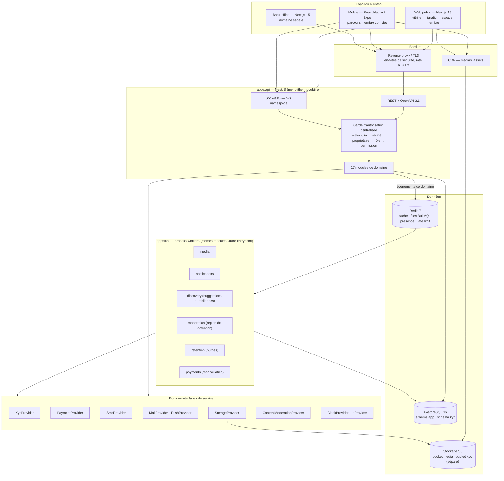
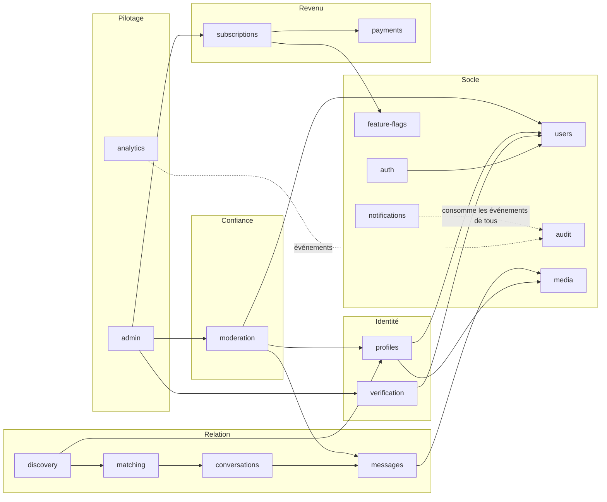
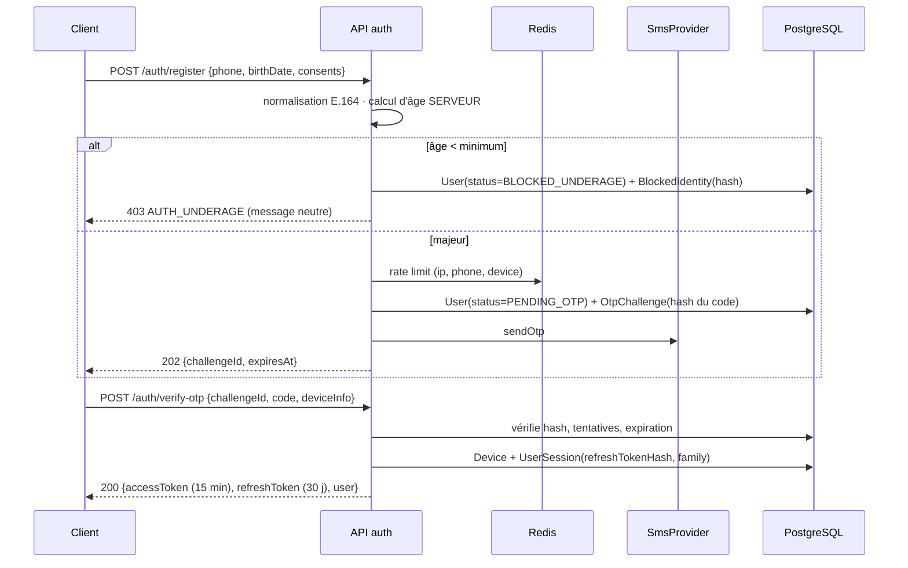

# 01 — Architecture générale

**Phase B — Conception** · Produit : « À Chacun Une Belle Âme »
Prérequis : [Phase A — audit et cadrage](./00-phase-a-audit-cadrage.md)

---

## 1. Principes directeurs

| Principe | Traduction concrète |
|---|---|
| **Le serveur décide** | Aucune règle de sécurité, d'éligibilité ou de quota n'est appliquée uniquement côté client. Le client masque, le serveur interdit. |
| **Un monolithe modulaire, pas des microservices** | Un déployable, 17 modules à frontières explicites. L'extraction ultérieure d'un module reste possible car aucune frontière n'est franchie par accès direct aux tables. |
| **Toute intégration externe derrière un port** | Le métier ne connaît jamais le nom d'un fournisseur. Une variable d'environnement choisit l'implémentation. |
| **Asynchrone par défaut pour tout ce qui est lourd** | Médias, notifications, suggestions, détections, purges, réconciliation : événement de domaine → file BullMQ. L'API reste rapide sur réseau lent. |
| **Autorisation déclarée, jamais implicite** | Chaque route porte une politique explicite. Un test échoue si une route n'en déclare pas. |
| **Auditabilité des opérations sensibles** | Toute action administrative et toute consultation de donnée sensible produit un événement d'audit append-only. |
| **Minimisation** | On ne stocke pas ce qui est calculable, pas ce qui n'est pas nécessaire, et pas plus longtemps que la durée configurée. |

---

## 2. Vue d'ensemble



**Point important :** l'API et les workers sont **le même code, deux points d'entrée** (`main.ts` / `worker.ts`). Cela
évite la duplication de la logique métier tout en permettant de dimensionner indépendamment le web et les traitements.

---

## 3. Les 17 modules de domaine



### Responsabilité de chaque module

| Module | Responsabilité | Ne fait jamais |
|---|---|---|
| `auth` | Inscription téléphone/OTP, connexion, sessions, tokens, appareils, récupération, rate limiting d'authentification | Décider de l'éligibilité produit (c'est `verification`) |
| `users` | Compte, statut de compte, rôles, consentements, suppression et export de données | Contenir la donnée de profil publique |
| `profiles` | Profil public, préférences, centres d'intérêt, photos, complétion, statut de disponibilité | Décider quel profil est visible (c'est `discovery`) |
| `verification` | Date de naissance, calcul d'âge, machine à états KYC, documents, décisions, badge | Stocker un document en clair ou hors du schéma `kyc` |
| `discovery` | Calcul du score, génération et service des suggestions quotidiennes, exclusions | Créer des matchs |
| `matching` | Intérêts (envoyés, reçus, refusés), matchs, annulation, blocages | Créer des messages |
| `conversations` | Cycle de vie d'une conversation, membres, état de lecture, verrouillage | Autoriser un envoi sans match (délégué au garde) |
| `messages` | Messages, statuts de livraison, pièces jointes, anti-spam, suppression logique | Modérer (c'est `moderation`) |
| `moderation` | Signalements, cas, actions, SLA, règles de détection, comptes liés | Prendre seule une sanction irréversible |
| `subscriptions` | Plans, abonnements, cycle de vie, droits Premium, boosts | Parler à un fournisseur de paiement |
| `payments` | `PaymentProvider`, transactions, webhooks idempotents, remboursements, réconciliation | Décider des droits fonctionnels |
| `notifications` | 4 canaux, préférences, modèles, file, anti-doublon, réessais | Contenir la règle métier déclenchante |
| `media` | Envoi, validation, EXIF, compression, miniatures, URLs signées, cycle de modération | Servir un média sans URL signée |
| `admin` | Surface back-office, files de travail, RBAC administratif | Contourner les règles de domaine |
| `analytics` | Événements produit pseudonymisés, agrégats, indicateurs, campagnes de migration | Stocker une donnée nominative dans les agrégats |
| `audit` | Journal append-only des actions sensibles | Être modifiable ou supprimable par l'application |
| `feature-flags` | Activation par environnement, par rôle, par pourcentage, par utilisateur | Être lu depuis le client sans filtrage |

### Règle de communication inter-modules

1. **Appel synchrone autorisé** uniquement vers le *service applicatif public* d'un autre module (exporté par son
   `*.module.ts`), jamais vers son repository ni ses tables.
2. **Événement de domaine** pour tout ce qui est asynchrone ou multi-destinataires (`match.created`,
   `verification.approved`, `photo.rejected`, `payment.succeeded`…).
3. **Interdiction absolue** : un `PrismaService` d'un module ne requête pas les tables d'un autre module. Un test
   d'architecture (lecture des imports) échoue sinon.

---

## 4. Architecture interne d'un module

```
apps/api/src/modules/<module>/
├── domain/                     # aucune dépendance à NestJS, Prisma, HTTP
│   ├── entities/               # objets métier + invariants
│   ├── value-objects/          # PhoneNumber, Age, Money, CursorId…
│   ├── events/                 # événements de domaine
│   ├── errors/                 # erreurs métier typées → codes stables
│   └── services/               # règles pures (ex. calcul du score)
├── application/                # cas d'usage
│   ├── use-cases/              # 1 classe = 1 cas d'usage, transactionnel
│   ├── ports/                  # interfaces des dépendances sortantes
│   └── dto/                    # entrées/sorties du cas d'usage
├── infrastructure/
│   ├── http/                   # contrôleurs, DTO de requête, politique d'autorisation
│   ├── ws/                     # passerelles Socket.IO (le cas échéant)
│   ├── persistence/            # repositories Prisma implémentant les ports
│   ├── adapters/               # implémentations des ports externes
│   └── jobs/                   # processeurs BullMQ
└── <module>.module.ts          # ce que le module expose au reste de l'application
```

**Bénéfice concret et vérifiable :** la règle « pas de message sans match mutuel », le calcul d'âge et le score de
compatibilité sont des fonctions pures testables en millisecondes, sans base de données ni conteneur.

---

## 5. Ports et adaptateurs

| Port | Méthodes principales | Implémentations MVP | Implémentation cible |
|---|---|---|---|
| `SmsProvider` | `sendOtp`, `sendTransactional` | `ConsoleSmsProvider` *(simulé)* | Passerelle SMS à contractualiser (Q4) |
| `KycProvider` | `submitDocument`, `getResult`, `handleWebhook` | `MockKycProvider` *(simulé)* + revue humaine | Prestataire KYC local (Q2) |
| `PaymentProvider` | `createCheckout`, `getTransaction`, `refund`, `verifyWebhook`, `parseWebhook` | `MockPaymentProvider` *(« Mode test »)* | Agrégateur mobile money + carte (Q3) |
| `StorageProvider` | `putObject`, `getSignedUrl`, `deleteObject`, `copyObject` | MinIO (S3 compatible) — **réel** | S3 ou équivalent |
| `MailProvider` | `send` | Mailpit — **réel en local** | Service transactionnel |
| `PushProvider` | `sendToDevice`, `sendToTopic` | `MockPushProvider` *(simulé)* | Adaptateur compatible FCM |
| `ContentModerationProvider` | `scanImage`, `scanText` | `RuleBasedModerationProvider` (règles) | Service de modération |
| `ClockProvider` | `now()` | `SystemClock` / `FrozenClock` en test | — |

**Sélection par environnement :** `SMS_PROVIDER=console|<réel>`, `KYC_PROVIDER=mock|<réel>`,
`PAYMENT_PROVIDER=mock|<réel>`. Aucun branchement conditionnel dans le métier ; l'injection se fait au niveau du
module NestJS.

**Garde-fou anti-mensonge :** au démarrage, l'API journalise en `WARN` la liste des ports en mode simulé. Si
`NODE_ENV=production` et qu'un port critique (`SmsProvider`, `PaymentProvider` avec paiement activé) est simulé,
**le démarrage échoue** sauf `ALLOW_MOCK_PROVIDERS_IN_PRODUCTION=true` explicitement posé.

---

## 6. Flux transverses

### 6.1 Authentification et session



- **Access token** JWT 15 min, signé RS256, contenant `sub`, `sid`, `roles`, `verificationStatus`, `accountStatus`.
- **Refresh token** opaque 30 jours, **haché (SHA-256) en base**, rotatif à chaque usage, rattaché à une *famille*.
  La réutilisation d'un token déjà consommé = vol présumé → **révocation de toute la famille** + événement d'audit
  + notification de sécurité.
- Le token porte `verificationStatus`, mais **le garde revalide en base** pour toute route sensible : un compte
  suspendu ne doit pas survivre 15 minutes.

### 6.2 Autorisation — la chaîne

```
Requête
  → AuthGuard              : token valide, session non révoquée
  → AccountStatusGuard     : compte ni suspendu ni banni ni supprimé
  → VerificationGuard      : statut VERIFIED requis (routes découverte/matching/messagerie)
  → OwnershipGuard         : la ressource appartient à l'appelant
  → RoleGuard/PermissionGuard : back-office uniquement
  → RateLimitGuard         : par IP, utilisateur, appareil, action
```

Chaque route déclare sa politique par décorateur :

```ts
@Auth({ verified: true, rateLimit: 'message.send', permissions: [] })
```

`@Public()` est le seul moyen d'ouvrir une route, et son usage est listé dans un test d'inventaire.

### 6.3 Temps réel

- Namespace `/ws`, authentification par access token à la poignée de main, **revalidée** à chaque reconnexion.
- Rooms : `user:{userId}` (notifications personnelles) et `conversation:{conversationId}` (messages).
- L'adhésion à une room de conversation est **vérifiée en base** (membre actif, non bloqué, match vivant).
- Adaptateur Redis pour le multi-instance. Repli long-polling activé (réseaux mobiles locaux).
- Les événements émis ne contiennent jamais de donnée sensible au-delà du nécessaire.

### 6.4 Événements de domaine et files

| File BullMQ | Producteurs | Traitements |
|---|---|---|
| `media` | `photo.uploaded`, `attachment.uploaded` | validation binaire, EXIF, ré-encodage, miniatures, pré-modération |
| `notifications` | tous | résolution des préférences, rendu du modèle, envoi multi-canal, réessais |
| `discovery` | planificateur quotidien | génération des suggestions par utilisateur actif |
| `moderation` | `report.created`, signaux de comportement | priorisation, règles de détection, alertes |
| `retention` | planificateur quotidien | purge des documents KYC, messages, comptes en grâce, événements analytics |
| `payments` | `payment.webhook.received`, planificateur | traitement idempotent, réconciliation, relances d'échec |

Réglages : `attempts: 5`, backoff exponentiel, `removeOnComplete` borné, **dead-letter queue** consultable au
back-office. Tout job porte un `jobId` déterministe quand l'idempotence l'exige.

---

## 7. Découpage du monorepo

```
a-chacun-une-belle-ame/
├── apps/
│   ├── api/                    # NestJS — REST, WS, workers
│   ├── web/                    # Next.js — vitrine + espace membre
│   ├── admin/                  # Next.js — back-office
│   └── mobile/                 # Expo — application membre
├── packages/
│   ├── contracts/              # schémas Zod, types partagés, codes d'erreur métier, constantes
│   ├── ui/                     # design system web (React) + tokens partagés avec le mobile
│   ├── config/                 # eslint, tsconfig, prettier, tailwind, jest partagés
│   └── sdk/                    # client d'API typé généré depuis OpenAPI
├── prisma/
│   ├── schema.prisma
│   ├── migrations/
│   └── seed/
├── docker/                     # compose, Dockerfiles, MinIO, Mailpit
├── docs/                       # tous les documents de conception
├── e2e/                        # Playwright — 18 parcours obligatoires
└── .github/workflows/          # CI
```

**`packages/contracts` est la clé de voûte.** Les schémas Zod y sont définis une fois et consommés par l'API
(validation d'entrée), le web, le mobile et le back-office. Un changement de contrat casse la compilation des
consommateurs — c'est le comportement recherché.

---

## 8. Gestion des erreurs

Une seule forme de réponse d'erreur, sur toutes les routes :

```json
{
  "error": {
    "code": "MSG_NO_MATCH",
    "message": "Vous ne pouvez écrire qu'après un accord mutuel.",
    "details": null,
    "requestId": "01J8XK2R4M7QF3D5",
    "timestamp": "2026-08-06T10:12:33.412Z"
  }
}
```

- `code` : **code métier stable**, jamais renommé (contrat public). Catalogue dans `packages/contracts/errors.ts`.
- `message` : message utilisateur en français, jamais un message technique.
- `details` : uniquement des erreurs de validation champ par champ. **Jamais** de trace, de requête SQL, de nom de
  table ni de valeur interne.
- `requestId` : corrélation avec les logs — c'est ce que le support demandera à l'utilisateur.
- Un filtre d'exception global convertit toute exception non typée en `INTERNAL_ERROR` 500 avec un message neutre.

Familles de codes : `AUTH_*`, `KYC_*`, `PROFILE_*`, `MEDIA_*`, `DISCOVERY_*`, `MATCH_*`, `MSG_*`, `MOD_*`,
`SUB_*`, `PAY_*`, `NOTIF_*`, `ADMIN_*`, `RATE_*`, `VALIDATION_*`.

---

## 9. Pagination

**Curseur opaque uniquement.** Aucun `OFFSET` sur une table susceptible de croître.

```
GET /discovery/suggestions?limit=20&cursor=eyJpZCI6IjAxSjhY...
→ { "items": [...], "nextCursor": "eyJpZCI6...", "hasMore": true }
```

Le curseur encode le tuple de tri (`createdAt`, `id`) en base64url, avec un index composite correspondant sur
chaque table concernée. `limit` par défaut 20, maximum 50.

---

## 10. Observabilité

- **Logs structurés JSON** (pino) : `requestId`, `userId` (pseudonymisé en `uid_<hash court>`), `route`, `durée`,
  `statut`. **Rédaction automatique** d'une liste de clés (`password`, `token`, `otp`, `documentUrl`,
  `messageBody`, `phone` partiellement masqué). Un test vérifie qu'aucun champ de la liste noire ne peut fuir.
- **Métriques** : latence par route, taux d'erreur, profondeur des files, âge du plus vieux job, SLA de modération,
  taux d'échec de paiement, coût OTP par inscription.
- **Traçage d'erreurs** avec `requestId` corrélé, sans corps de message ni document.
- **Alertes** : file de modération dépassant le SLA, dead-letter non vide, taux d'échec OTP anormal, consultation
  massive de documents KYC par un compte administrateur.

---

## 11. Montée en charge

Cible : 9 000 membres au lancement, capacité x10 (90 000) sans refonte.

| Levier | Au MVP | À x10 |
|---|---|---|
| API | 2 instances | 4 à 8 instances derrière le répartiteur |
| Workers | 1 process, files séparées | 1 process par famille de file |
| PostgreSQL | 1 instance + PgBouncer | + réplicas de lecture pour `discovery` et `analytics` |
| Redis | 1 instance | Redis dédié aux files, séparé du cache |
| Médias | Stockage S3 + CDN | inchangé (déjà hors chemin applicatif) |
| Suggestions | Calcul nocturne par lots | Partitionnement par pays / fenêtre horaire |

Le point de contention attendu est le **calcul des suggestions** (comparaison de candidats). Il est traité par
pré-filtrage SQL indexé (pays, ville, tranche d'âge, statut vérifié, non bloqué) **avant** tout scoring applicatif,
avec un plafond de candidats évalués par utilisateur. Détail dans [04 — algorithme de matching](./04-algorithme-de-matching.md).

---

## 12. Environnements

| Environnement | Usage | Données | Fournisseurs |
|---|---|---|---|
| `local` | Développement | Seed anonyme | Tous simulés (MinIO et Mailpit réels) |
| `ci` | Tests automatisés | Base éphémère | Tous simulés, horloge figée |
| `staging` (recette) | Validation métier, tests de charge | Anonymisées, jamais de copie de production | Réels en mode bac à sable si disponibles |
| `production` | Service | Réelles | Réels — démarrage refusé si un port critique est simulé |

Voir [10 — plan de déploiement](./10-plan-de-deploiement.md).
