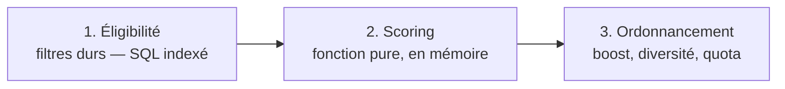

# 04 — Algorithme de découverte et de matching

**Principe fondateur.** Le score est **déterministe, explicable et reproductible** (ADR-007). Pour un couple donné et
un état de données donné, il produit toujours la même valeur. Aucun apprentissage automatique, aucun signal
comportemental au MVP.

Deux raisons, et elles priment sur la pertinence brute : un score non explicable est **intestable** et **indéfendable**
face à un membre qui conteste une suggestion ; et à l'ouverture, il n'existe de toute façon aucune donnée
comportementale sur laquelle apprendre.

---

## 1. Le pipeline en trois temps



| Étape | Où | Coût | Résultat |
|---|---|---|---|
| 1. Éligibilité | PostgreSQL, index `(status, cityId)` + `(accountStatus, verificationStatus)` | O(index) | ≤ `MAX_CANDIDATES` (défaut 500) candidats |
| 2. Scoring | Fonction pure TypeScript, `domain/services/compatibility-score.ts` | O(n) sur 500 max | score ∈ [0, 1] par candidat |
| 3. Ordonnancement | En mémoire | O(n log n) | `dailySuggestionLimit` suggestions |

**Le plafond de candidats est ce qui garantit la tenue à x10 :** le coût du scoring ne dépend pas de la taille de la
base, seulement du plafond. Si le pré-filtre remonte plus de `MAX_CANDIDATES`, on retient les plus récemment actifs.

---

## 2. Étape 1 — Filtres d'éligibilité (durs, non négociables)

Un candidat est écarté si **l'une** de ces conditions est vraie. Ces filtres sont appliqués en SQL, jamais en mémoire,
et **jamais côté client**.

| # | Exclusion | Traduction |
|---|---|---|
| E1 | Non majeur | Impossible par construction : `BLOCKED_UNDERAGE` n'atteint jamais cette table |
| E2 | Non vérifié | `verificationStatus != VERIFIED` |
| E3 | Compte non actif | `accountStatus ∉ {ACTIVE}` — exclut pause, restriction, suspension, bannissement, suppression |
| E4 | Profil non publiable | `Profile.status != ACTIVE` ou `completionRate < SEUIL_PUBLICATION` (défaut 60) |
| E5 | Aucune photo approuvée | `primaryPhotoId IS NULL` |
| E6 | Blocage dans un sens ou l'autre | ligne dans `Block` entre les deux, quel que soit le sens |
| E7 | Déjà vu | ligne dans `ProfileView` |
| E8 | Déjà décidé | ligne dans `Like` (intérêt **ou** refus) |
| E9 | Déjà en match | ligne dans `Match` |
| E10 | Genre incompatible | selon `matching.policy` (ADR-019) : le genre du candidat doit correspondre à `seekingGender` de l'utilisateur **et** réciproquement |
| E11 | Hors tranche d'âge **réciproque** | l'âge du candidat hors `[minAge, maxAge]` de l'utilisateur, **ou** l'âge de l'utilisateur hors tranche du candidat |
| E12 | Hors zone souhaitée | si `PreferenceCity` est renseignée et que la ville n'y figure pas ; si `sameCountryOnly` et pays différent |
| E13 | Soi-même | `candidateId = userId` |

**E11 est réciproque et c'est délibéré.** Suggérer un profil qui, par ses propres critères, ne peut pas être
intéressé produit une frustration des deux côtés et fausse le taux de match.

**Note sur E4.** Un profil incomplet n'est pas seulement mal noté, il est **invisible**. C'est ce qui donne au taux de
complétion sa valeur : le membre a un intérêt direct à compléter son profil.

---

## 3. Étape 2 — Le score de compatibilité

### 3.1 Formule

Pour un utilisateur `u` et un candidat `c` :

```
Score(u, c) = Σ ( wₖ × Cₖ(u, c) )     avec   Σ wₖ = 1  et  Cₖ ∈ [0, 1]
              k
```

Le score brut appartient donc à `[0, 1]`. Il est ensuite modulé (§4).

### 3.2 Les huit composantes

| k | Composante | Poids `wₖ` (défaut) | Formule |
|---|---|---|---|
| C1 | Compatibilité d'âge | **0,20** | voir 3.3 |
| C2 | Proximité géographique | **0,15** | voir 3.4 |
| C3 | Centres d'intérêt communs | **0,20** | voir 3.5 |
| C4 | Valeurs déclarées | **0,10** | voir 3.6 |
| C5 | Situation familiale | **0,10** | voir 3.7 |
| C6 | Réciprocité des préférences | **0,10** | voir 3.8 |
| C7 | Complétion du profil | **0,05** | voir 3.9 |
| C8 | Activité récente | **0,10** | voir 3.10 |
| | **Total** | **1,00** | |

Le statut de vérification n'a **pas** de poids : c'est un filtre dur (E2), tous les candidats sont vérifiés. Lui
donner un poids serait mathématiquement sans effet et trompeur dans la documentation.

Les poids sont stockés dans `FeatureFlag['matching.weights'].payload` et modifiables **sans redéploiement**. Leur
somme est validée au chargement : si elle s'écarte de 1,0 de plus de 0,001, la configuration est rejetée et les poids
par défaut du code s'appliquent, avec une alerte.

### 3.3 C1 — Compatibilité d'âge

Soit `Δ = |age(u) − age(c)|` et `T = ECART_AGE_TOLERE` (défaut 10 ans).

```
C1 = max(0, 1 − Δ / T)
```

`Δ = 0` → 1,0 · `Δ = 5` → 0,5 · `Δ ≥ 10` → 0. La tranche d'âge acceptée est déjà traitée par E11 ; C1 exprime la
préférence **au sein** de cette tranche.

### 3.4 C2 — Proximité géographique

Barème discret (ADR-011 : pas de distance kilométrique) :

```
C2 = 1,00  si même ville
   = 0,70  si même région
   = 0,40  si même pays
   = 0,10  sinon
```

Le seuil 0,10 plutôt que 0 permet à la diaspora d'apparaître sans dominer — un ajustement direct par configuration
au moment de l'ouverture de la phase 2.

### 3.5 C3 — Centres d'intérêt communs

Soit `Iᵤ` et `I_c` les ensembles d'intérêts (catégories hors « valeurs ») :

```
C3 = |Iᵤ ∩ I_c| / max(1, min(|Iᵤ|, |I_c|))
```

Dénominateur `min` et non union (Jaccard) **volontairement** : un membre ayant déclaré 15 intérêts ne doit pas être
pénalisé face à un membre en ayant déclaré 3. Ce que l'on mesure, c'est la proportion du plus petit ensemble qui est
partagée. Résultat borné à 1.

### 3.6 C4 — Valeurs déclarées

Identique à C3, restreint aux intérêts de catégorie `valeurs` (famille, foi, ambition, fidélité, engagement…), qui
sont sur ce produit le meilleur prédicteur d'une relation sérieuse.

```
C4 = |Vᵤ ∩ V_c| / max(1, min(|Vᵤ|, |V_c|))
```

Si l'un des deux n'a déclaré aucune valeur : `C4 = 0,5` (neutre — ne pas pénaliser une absence d'information,
ne pas récompenser non plus).

### 3.7 C5 — Situation familiale

```
C5 = 1,00  si relationship(c) ∈ acceptedRelationshipStatuses(u) ET réciproquement
   = 0,50  si accepté dans un seul sens
   = 0,00  si refusé des deux côtés
```

Puis, sur les enfants :

```
si acceptsChildren(u) est renseigné et hasChildren(c) ≠ null :
    C5 = C5 × (1,0 si compatible, 0,3 sinon)
```

Non éliminatoire par choix : la situation familiale est un critère fort mais déclaratif, souvent mal renseigné au
début. L'écraser à zéro viderait les suggestions des nouveaux profils.

### 3.8 C6 — Réciprocité des préférences

Mesure la probabilité que le candidat soit lui aussi intéressé — c'est le levier direct du **taux de match** :

```
C6 = 0,4 × [age(u) ∈ [minAge(c), maxAge(c)]]      (déjà garanti par E11 → vaut 0,4)
   + 0,3 × [ville(u) ∈ zone souhaitée par c]
   + 0,3 × [completionRate(u) ≥ 60]
```

`[·]` vaut 1 si vrai, 0 sinon. C6 récompense l'utilisateur qui a lui-même un profil attractif au regard des critères
du candidat — ce qui aligne l'intérêt individuel et la qualité collective des suggestions.

### 3.9 C7 — Complétion du profil

```
C7 = completionRate(c) / 100
```

Le taux est calculé à chaque écriture du profil selon une grille fixe :

| Élément | Points |
|---|---|
| Prénom, date de naissance, genre, ville | 15 |
| 1 photo approuvée | 15 |
| 3 photos approuvées | +10 (25 au total) |
| Présentation ≥ 100 caractères | 15 |
| « Ce que je recherche » ≥ 60 caractères | 10 |
| Valeurs (≥ 3 déclarées) | 10 |
| Centres d'intérêt (≥ 5 déclarés) | 10 |
| Situation familiale | 5 |
| Profession ou niveau d'études | 5 |
| Préférences de recherche renseignées | 5 |
| **Total** | **100** |

### 3.10 C8 — Activité récente

Soit `d` = jours depuis `lastActiveAt` :

```
C8 = 1,00  si d ≤ 1
   = 0,80  si d ≤ 3
   = 0,60  si d ≤ 7
   = 0,30  si d ≤ 30
   = 0,05  sinon
```

Suggérer un profil inactif est la manière la plus sûre de faire échouer une conversation. C8 pèse peu (0,10) mais
suffit à départager deux profils par ailleurs équivalents.

---

## 4. Étape 3 — Modulation et ordonnancement

### 4.1 Score final

```
ScoreFinal(u, c) = Score(u, c) × Boost(c) × Nouveauté(c) × Équité(c)
```

| Facteur | Valeur | Justification |
|---|---|---|
| `Boost(c)` | `multiplier` du boost actif (défaut 2,0), sinon 1,0 | Fonctionnalité payante (feature flag `boost.enabled`) |
| `Nouveauté(c)` | 1,15 si le profil a moins de 7 jours, sinon 1,0 | Un nouvel inscrit sans visibilité se désengage vite — enjeu direct de rétention à J+7 |
| `Équité(c)` | 0,85 si le candidat a déjà reçu plus de `PLAFOND_IMPRESSIONS_JOUR` (défaut 50) impressions aujourd'hui, sinon 1,0 | Empêche que quelques profils captent toutes les suggestions et que les autres ne soient jamais vus |

**Le facteur `Boost` est le seul levier payant sur le classement, et il est borné.** Il ne contourne aucun filtre
d'éligibilité : un membre Premium ne voit pas de profils qu'il ne devrait pas voir, il est simplement mieux classé.
C'est la traduction du principe « les fonctionnalités payantes ne compromettent jamais la sécurité ou le consentement ».

### 4.2 Diversité

Après tri décroissant, on applique une contrainte simple : **pas plus de 40 % des suggestions d'un lot provenant de la
même ville**, tant que des candidats d'autres villes atteignent au moins 70 % du score du dernier retenu. Évite le lot
monotone dans les grandes villes.

### 4.3 Quota quotidien

| Offre | Suggestions / jour | Intérêts / jour |
|---|---|---|
| Gratuite | 10 | 10 |
| Premium | 30 | 50 |

Le quota est **remis à zéro à 00:00 UTC**, valeurs configurables (H7). Le compteur est côté serveur (Redis + vérification
en base) : un client modifié ne peut pas dépasser son quota.

---

## 5. Exemple calculé (cas de test de référence)

**Aminata**, 32 ans, Douala (Cameroun), profil complété à 85 %, intérêts {lecture, voyage, cuisine, musique, sport},
valeurs {famille, foi, fidélité}, célibataire sans enfant, cherche 30-40 ans, active aujourd'hui.

**Jean**, 35 ans, Douala, complétion 90 %, intérêts {lecture, voyage, football, cinéma}, valeurs {famille, fidélité,
ambition}, célibataire sans enfant, cherche 28-38 ans, actif il y a 2 jours, pas de boost, inscrit il y a 3 mois.

| Composante | Calcul | Valeur | × poids |
|---|---|---|---|
| C1 âge | `1 − 3/10` | 0,700 | 0,1400 |
| C2 géo | même ville | 1,000 | 0,1500 |
| C3 intérêts | `2 / min(5,4) = 2/4` | 0,500 | 0,1000 |
| C4 valeurs | `2 / min(3,3) = 2/3` | 0,667 | 0,0667 |
| C5 famille | accepté des deux côtés, enfants compatibles | 1,000 | 0,1000 |
| C6 réciprocité | `0,4 + 0,3 + 0,3` (32 ∈ [28,38] ✓, ville ✓, 85 ≥ 60 ✓) | 1,000 | 0,1000 |
| C7 complétion | `90/100` | 0,900 | 0,0450 |
| C8 activité | `d = 2 → 0,80` | 0,800 | 0,0800 |
| | | **Score brut** | **0,7817** |

Modulation : `Boost = 1,0` · `Nouveauté = 1,0` (3 mois) · `Équité = 1,0` → **ScoreFinal = 0,782**.

Ce cas est figé comme test unitaire de référence (`compatibility-score.spec.ts`) : toute modification du code de
scoring qui change cette valeur sans changement de configuration fait échouer la CI.

---

## 6. Paramètres configurables

| Clé | Défaut | Effet |
|---|---|---|
| `matching.weights` | voir 3.2 | Poids des 8 composantes (somme validée à 1,0) |
| `matching.policy` | `HETERO` | Politique de mise en relation (ADR-019, question Q7) |
| `matching.ageTolerance` | 10 | Paramètre `T` de C1 |
| `matching.maxCandidates` | 500 | Plafond de scoring — le garant de la performance |
| `matching.minCompletionToPublish` | 60 | Seuil E4 |
| `matching.dailyLimitFree` / `Premium` | 10 / 30 | Quota de suggestions |
| `matching.likeLimitFree` / `Premium` | 10 / 50 | Quota d'intérêts |
| `matching.newProfileBoostDays` | 7 | Fenêtre du facteur Nouveauté |
| `matching.fairnessImpressionCap` | 50 | Seuil du facteur Équité |
| `premium.filters` | `false` | Active `minEducationLevel` et `requiredInterestIds` |
| `boost.enabled` | `false` | Active l'achat de boost |

---

## 7. Non-discrimination

Ce qui **n'entre pas** dans le score, et ne peut pas y entrer :

- l'origine, l'appartenance ethnique, la nationalité (non collectées) ;
- la religion **en tant que telle** — seules des valeurs déclarées volontairement par le membre et présentées comme
  critère de compatibilité entrent dans C4, symétriquement pour tous ;
- le revenu, la classe sociale, le patrimoine (non collectés) ;
- l'état de santé, le handicap (non collectés) ;
- l'apparence physique ou toute analyse automatique des photos ;
- toute donnée dérivée du nom.

Le genre n'intervient que par la politique de mise en relation configurable (ADR-019, question Q7 en attente de
validation juridique), jamais comme pondération.

**Contrôle d'équité mesurable :** un rapport hebdomadaire au back-office compare la distribution des impressions
reçues par tranche d'âge, par ville et par genre à la distribution de la base éligible. Un écart supérieur à 20 %
déclenche une alerte et une revue des pondérations — un algorithme documenté n'est utile que si on vérifie ce qu'il
produit réellement.

---

## 8. Génération des suggestions

- **Traitement nocturne** (worker `discovery`, 03:00 UTC) : pour chaque utilisateur actif dans les 30 derniers jours,
  calcul et mise en cache Redis du lot du jour (TTL 26 h).
- **Calcul à la demande** en repli si le cache est absent (nouvel inscrit, utilisateur revenu) — même code, même
  résultat.
- **Invalidation** immédiate du cache sur : blocage, signalement, changement de préférences, suspension du candidat.
  Un profil suspendu à 10 h ne doit pas être suggéré à 11 h.
- **Idempotence** : `jobId = suggestions:{userId}:{YYYY-MM-DD}` — un rejeu du job ne produit pas deux lots.

---

## 9. Limitations assumées au MVP

1. **Pas de distance kilométrique** — granularité ville/région/pays (ADR-011).
2. **Pas d'apprentissage** — un membre qui envoie systématiquement un intérêt à un certain type de profil ne verra pas
   ses suggestions s'adapter. C'est le premier chantier V2, et les données pour l'alimenter sont collectées dès
   maintenant (`ProfileView.score`, `Like`, `Match`, `AnalyticsEvent`).
3. **Pas de détection de profil « populaire mais non réciproque »** — un profil recevant énormément d'intérêts sans
   jamais répondre continue d'être suggéré. Atténué par le facteur Équité, pas résolu.
4. **Le score ne mesure pas la sincérité.** Aucun algorithme ne le fait. C'est la vérification d'identité et la
   modération qui portent cette promesse — pas le matching.
