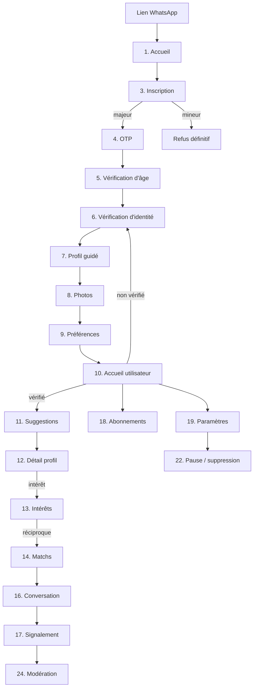

# 07 — Parcours et écrans (UX/UI)

Mobile-first, français, réseau lent, smartphones d'entrée de gamme. L'interface doit être **rassurante avant d'être
séduisante** : sur une plateforme de rencontres sérieuses, la première émotion recherchée est la confiance.

---

## 1. Principes de conception

| Principe                        | Traduction concrète                                                                                                                                                                      |
| ------------------------------- | ---------------------------------------------------------------------------------------------------------------------------------------------------------------------------------------- |
| **Chaleureux, pas superficiel** | Cartes profil hautes montrant valeurs et intentions **avant** les photos. Pas de balayage rapide gauche/droite : deux boutons explicites, « Envoyer un intérêt » et « Passer ».          |
| **Rassurant**                   | Le badge « Identité vérifiée » est visible partout où un profil apparaît. Signaler et bloquer sont accessibles en deux touches depuis n'importe quel écran de profil ou de conversation. |
| **Guidé**                       | L'onboarding est une suite d'étapes courtes, une question par écran, avec progression visible et reprise possible à tout moment.                                                         |
| **Économe**                     | ≤ 200 Ko de JS initial, images WebP/AVIF servies aux dimensions d'affichage, liste virtualisée, aucune police externe, aucun chargeur bloquant plein écran.                              |
| **Honnête**                     | Tout mode simulé porte un bandeau « Mode test ». Les délais annoncés (« vérification sous 24 h ») reflètent le SLA réel, pas une promesse commerciale.                                   |
| **Inclusif**                    | Contraste AA minimum, cibles tactiles ≥ 44 px, aucun sens porté par la couleur seule, textes lisibles à 200 % de zoom.                                                                   |

### Identité visuelle proposée (à valider — question Q11)

- **Terracotta chaleureux** `#C4593B` en couleur d'action — proche des terres d'Afrique de l'Ouest et Centrale,
  loin du rouge « passion » des applications de rencontres occasionnelles.
- **Vert profond** `#1F4D3D` en couleur de confiance — badge vérifié, messages de sécurité.
- **Sable** `#F5EFE7` en fond, **encre** `#1C1917` en texte (contraste 15:1).
- Typographie système (`-apple-system`, `Roboto`) : zéro octet téléchargé, rendu immédiat, lisible sur tout appareil.
- Angles doux, ombres discrètes, photos en portrait 4:5, aucune animation supérieure à 200 ms.

### Conventions transverses à tous les écrans

- **Chargement** : squelettes de contenu, jamais de sablier plein écran. Toute action est optimiste quand elle est
  réversible (envoi de message), jamais quand elle ne l'est pas (envoi d'un intérêt, paiement).
- **Erreurs** : message en français orienté action, jamais de code technique, bouton « Réessayer ». Hors ligne : bandeau
  persistant « Connexion perdue — vos actions seront envoyées à la reconnexion ».
- **Accessibilité** : navigation clavier complète, focus visible, libellés associés, régions ARIA live pour les
  messages entrants, titre de page unique, ordre de tabulation logique.

---

## 2. Les 24 écrans

### 2.1 Découverte du service

#### 1. Page d'accueil (vitrine)

- **Objectif.** Convertir un membre du groupe WhatsApp en inscription, en moins de 30 secondes sur réseau lent.
- **Composants.** Titre de promesse, trois bénéfices (membres vérifiés, messagerie sur accord mutuel, modération sous 24 h), preuve sociale (« plus de 9 000 membres de la communauté »), bouton « Créer mon compte », lien de connexion, mention « réservé aux personnes majeures », pied de page légal.
- **États vides.** Sans objet.
- **Chargement.** Rendu statique pré-généré, aucun appel API bloquant. Première image en lazy loading.
- **Erreurs.** Sans objet (page statique).
- **Permissions.** `PUBLIC`.
- **Actions.** Créer un compte · Se connecter · Lire les CGU.
- **Accessibilité.** Un seul `h1`, image décorative en `alt=""`, contraste AA sur l'image d'en-tête.

#### 2. Présentation du service

- **Objectif.** Lever les objections : « est-ce sérieux ? », « mes données sont-elles protégées ? », « qui va me voir ? ».
- **Composants.** Le parcours en 4 étapes, explication de la vérification d'identité, explication du consentement mutuel, charte de bonne conduite résumée, FAQ (8 questions), rappel du prix (ou « gratuit au lancement »).
- **Chargement.** Statique. FAQ en `
` natif — aucun JavaScript.
- **Permissions.** `PUBLIC`.
- **Actions.** Créer un compte · Lire la charte complète.
- **Accessibilité.** FAQ en éléments natifs dépliables, hiérarchie de titres continue.

#### 3. Inscription

- **Objectif.** Recueillir le strict minimum : numéro, date de naissance, genre, consentements.
- **Composants.** Sélecteur d'indicatif pays (CM/BJ/CI en tête), champ numéro, sélecteur de date de naissance (année en premier — plus rapide au pouce), genre, cases de consentement **non pré-cochées** (CGU, confidentialité, charte), champ code d'invitation pré-rempli depuis le lien, bouton « Recevoir mon code ».
- **États vides.** Sans objet.
- **Chargement.** Bouton en état occupé, formulaire désactivé.
- **Erreurs.** Numéro invalide · numéro déjà utilisé (« Ce numéro a déjà un compte — se connecter ») · **âge minimum non atteint : écran dédié, message respectueux et définitif, sans possibilité de revenir modifier la date** · trop de tentatives.
- **Permissions.** `PUBLIC`.
- **Actions.** Recevoir le code · Se connecter · Consulter les CGU.
- **Accessibilité.** `inputmode="tel"`, `autocomplete="tel"`, erreurs associées par `aria-describedby`, jamais de couleur seule.

#### 4. Validation OTP

- **Objectif.** Confirmer la possession du numéro.
- **Composants.** 6 champs liés, numéro masqué rappelé (`+237 6XX XXX X89`), compte à rebours de renvoi (60 s), lien « Modifier mon numéro », **en développement : encart « Mode test — code affiché ici »**.
- **États vides.** Sans objet.
- **Chargement.** Validation automatique à la saisie du 6ᵉ chiffre.
- **Erreurs.** Code incorrect (essais restants affichés) · code expiré · trop d'essais → nouveau défi requis.
- **Permissions.** `PUBLIC`.
- **Actions.** Valider · Renvoyer · Modifier le numéro.
- **Accessibilité.** `autocomplete="one-time-code"`, collage du code entier géré, annonce vocale des erreurs.

### 2.2 Vérification

#### 5. Vérification d'âge

- **Objectif.** Confirmer la date de naissance déclarée et expliquer pourquoi elle sera verrouillée.
- **Composants.** Rappel de la date saisie, explication (« votre âge sera calculé automatiquement et ne pourra plus être modifié après vérification »), avertissement sur les conséquences d'une fausse déclaration, confirmation explicite.
- **Erreurs.** Incohérence avec la pièce d'identité → écran de vérification complémentaire.
- **Permissions.** `AUTH_PENDING`.
- **Actions.** Confirmer · Corriger (possible **uniquement** avant vérification).
- **Accessibilité.** Avertissement en `role="note"`, pas en couleur seule.

#### 6. Vérification d'identité

- **Objectif.** Obtenir une pièce et un selfie exploitables **du premier coup** — chaque reprise coûte un abandon.
- **Composants.** Choix du type de pièce, cadre de prise de vue avec gabarit, exemples visuels « bon / mauvais », capture du selfie, indicateur de progression, explication de l'usage et de la durée de conservation, mention « ces documents ne sont jamais visibles par les autres membres ».
- **États vides.** Aucun document → écran d'introduction rassurant.
- **Chargement.** Barre de progression par fichier, reprise après coupure réseau, compression avant envoi.
- **Erreurs.** Photo floue ou trop sombre (détection locale avant envoi) · fichier trop lourd · type non accepté · pièce déjà utilisée par un autre compte (message neutre, cas transmis à la modération).
- **Permissions.** `AUTH_PENDING` puis `OWNER`.
- **Actions.** Prendre la photo · Reprendre · Envoyer · Passer pour l'instant (avec rappel du blocage des fonctions).
- **Accessibilité.** Alternative à la capture par appareil photo (import de fichier), instructions textuelles complètes — l'écran doit être utilisable sans voir le cadrage.

#### 6b. Attente de vérification _(état de l'écran 6, pas un écran de plus)_

- Statut clair (« en cours de vérification — réponse sous 24 h »), ce qui est déjà accessible, ce qui ne l'est pas encore, invitation à compléter le profil pendant l'attente.

### 2.3 Construction du profil

#### 7. Création guidée du profil

- **Objectif.** Atteindre 60 % de complétion sans lasser : une question par écran.
- **Composants.** Barre de progression, prénom, ville (recherche dans un référentiel fermé), situation familiale, enfants, profession et études (marquées facultatives), présentation, « ce que je recherche », valeurs (jetons sélectionnables), centres d'intérêt (jetons), bouton « Continuer », lien « Reprendre plus tard ».
- **États vides.** Suggestions d'amorce (« Ce que j'apprécie chez quelqu'un… ») pour débloquer l'écriture.
- **Chargement.** Enregistrement automatique à chaque étape — une coupure réseau ne perd jamais une saisie.
- **Erreurs.** Texte trop court · caractères interdits · ville introuvable (proposer la plus proche).
- **Permissions.** `AUTH_PENDING`.
- **Actions.** Continuer · Revenir · Reprendre plus tard.
- **Accessibilité.** Jetons = cases à cocher réelles, compteur de caractères annoncé, progression en `aria-valuenow`.

#### 8. Ajout de photos

- **Objectif.** Obtenir 3 à 6 photos de qualité acceptable.
- **Composants.** Grille de 6 emplacements, glisser-déposer pour réordonner (avec alternative par boutons), indication « photo principale », conseils (« visage visible, photo récente, pas de groupe »), statut par photo (en modération, approuvée, refusée avec motif).
- **États vides.** Emplacements en pointillés, message « Ajoutez au moins 3 photos pour être visible ».
- **Chargement.** Miniature immédiate depuis le fichier local, envoi en arrière-plan, statut « en modération » sous 1 s.
- **Erreurs.** Trop lourde (compression automatique proposée) · format non accepté · maximum atteint · **photo refusée : motif explicite et voie de contestation**.
- **Permissions.** `AUTH_PENDING` puis `OWNER`.
- **Actions.** Ajouter · Supprimer · Réordonner · Définir comme principale.
- **Accessibilité.** Réordonnancement au clavier obligatoire, statut de chaque photo en texte et non en pastille de couleur seule.

#### 9. Définition des préférences

- **Objectif.** Recueillir les critères qui alimentent le matching, sans donner l'impression de commander un produit.
- **Composants.** Tranche d'âge (curseur double), villes souhaitées, « même pays uniquement », situations familiales acceptées, enfants, **filtres Premium visibles mais verrouillés avec cadenas et explication**.
- **États vides.** Valeurs par défaut raisonnables pré-remplies (±7 ans, ma ville et ma région).
- **Erreurs.** Tranche incohérente · critères trop restrictifs → **avertissement « Moins de 5 profils correspondent — élargissez pour recevoir des suggestions »**.
- **Permissions.** `AUTH_PENDING`.
- **Actions.** Enregistrer · Réinitialiser · Découvrir Premium.
- **Accessibilité.** Curseur double utilisable au clavier avec valeurs saisissables en champ texte.

### 2.4 Cœur du produit

#### 10. Accueil utilisateur

- **Objectif.** En un écran : ce qui m'attend et ce qu'il me reste à faire.
- **Composants.** Salutation, carte de complétion du profil (si < 100 %), carte de statut de vérification (si non vérifié), nouveaux intérêts reçus, nouveaux matchs, messages non lus, accès aux suggestions du jour, conseil de sécurité tournant.
- **États vides.** Nouveau membre : parcours de démarrage en 3 étapes. Membre vérifié sans activité : « Vos suggestions du jour vous attendent ».
- **Chargement.** Squelettes de cartes ; l'écran s'affiche même si une section échoue.
- **Erreurs.** Section en échec → carte de repli avec « Réessayer », **jamais d'écran d'erreur global**.
- **Permissions.** `AUTH` (contenu adapté selon `VERIFIED`).
- **Actions.** Voir les suggestions · Compléter mon profil · Ouvrir une conversation.
- **Accessibilité.** Régions repérables, ordre de lecture = ordre d'importance.

#### 11. Suggestions

- **Objectif.** Présenter le lot du jour de façon posée, sans mécanique de défilement compulsif.
- **Composants.** Carte plein écran : photo principale, prénom, âge, ville, badge vérifié, **3 valeurs et intérêts communs mis en avant**, extrait de « ce que je recherche », boutons « Passer » et « Envoyer un intérêt », lien « Voir le profil complet », compteur de suggestions restantes.
- **États vides.** Quota atteint : « Revenez demain » + heure de réinitialisation + proposition Premium. Aucun profil compatible : « Élargissez vos critères » avec lien direct.
- **Chargement.** Préchargement de la carte suivante ; image en flou progressif.
- **Erreurs.** Quota dépassé (429) → écran dédié, pas un message d'erreur. Profil devenu indisponible → carte suivante, silencieusement.
- **Permissions.** `VERIFIED` — un membre non vérifié voit un écran d'explication, pas une erreur.
- **Actions.** Envoyer un intérêt · Passer · Voir le profil · Signaler.
- **Accessibilité.** Deux boutons réels et distincts (pas de geste de balayage obligatoire), annonce du résultat de l'action.

#### 12. Détail d'un profil

- **Objectif.** Donner de quoi décider sérieusement.
- **Composants.** Galerie (3 à 6 photos), prénom, âge, ville, badge vérifié, dernière activité en granularité grossière, présentation complète, ce qu'il ou elle recherche, valeurs, centres d'intérêt (communs mis en évidence), situation familiale, profession et études, boutons d'action, menu « Signaler / Bloquer ».
- **États vides.** Champs facultatifs non remplis : simplement absents, jamais « Non renseigné » en gris — l'absence ne doit pas dévaloriser.
- **Chargement.** Squelette ; photos en chargement progressif.
- **Erreurs.** 404 → « Ce profil n'est plus disponible » (message identique qu'il s'agisse d'une suppression, d'une suspension ou d'un blocage).
- **Permissions.** `VERIFIED`.
- **Actions.** Envoyer un intérêt · Passer · Signaler · Bloquer · Partager (désactivé au MVP).
- **Accessibilité.** Galerie navigable au clavier, `alt` descriptif générique (« Photo de profil 2 sur 5 »).

#### 13. Intérêts envoyés et reçus

- **Objectif.** Rendre visible l'activité et créer une raison de revenir.
- **Composants.** Deux onglets. Reçus : grille de cartes, **floutées en offre gratuite avec compteur exact** et invitation Premium ; Envoyés : liste avec statut (en attente / accepté / refusé) et possibilité de retirer.
- **États vides.** « Personne ne vous a encore envoyé d'intérêt — complétez votre profil pour être plus visible » avec lien direct.
- **Chargement.** Grille en squelettes.
- **Erreurs.** Repli avec « Réessayer ».
- **Permissions.** `VERIFIED`.
- **Actions.** Ouvrir un profil · Répondre à un intérêt · Retirer un intérêt · Découvrir Premium.
- **Accessibilité.** Le floutage n'est **pas** un simple filtre CSS : les données ne sont pas envoyées au client. Un lecteur d'écran annonce « profil masqué », jamais un nom.

#### 14. Liste des matchs

- **Objectif.** Célébrer sobrement et pousser vers la première conversation.
- **Composants.** Bandeau « Nouveaux matchs » (cercles), liste avec date, indicateur « conversation non démarrée », accès direct au message.
- **États vides.** « Vos matchs apparaîtront ici — un match se forme quand l'intérêt est réciproque. »
- **Chargement.** Squelettes.
- **Permissions.** `VERIFIED`.
- **Actions.** Ouvrir la conversation · Voir le profil · Annuler le match.
- **Accessibilité.** Cercles = boutons réels avec libellé (« Ouvrir la conversation avec Aminata »).

#### 15. Liste des conversations

- **Objectif.** Accéder rapidement aux échanges en cours.
- **Composants.** Liste triée par dernier message : photo, prénom, aperçu, horodatage relatif, pastille de non-lus, indicateur de blocage ou de verrouillage.
- **États vides.** « Aucune conversation — vos matchs sont le point de départ » avec lien vers les matchs.
- **Chargement.** Squelettes de lignes ; données en cache affichées immédiatement puis rafraîchies.
- **Erreurs.** Hors ligne : liste en cache avec bandeau.
- **Permissions.** `VERIFIED`.
- **Actions.** Ouvrir · Archiver · Mettre en silence · Bloquer.
- **Accessibilité.** Pastille de non-lus doublée d'un texte (« 3 messages non lus »).

#### 16. Conversation

- **Objectif.** Échanger en sécurité, avec les outils de protection à portée immédiate.
- **Composants.** En-tête (photo, prénom, badge vérifié, menu), fil des messages avec statuts envoyé/livré/lu, indicateur de saisie, champ de saisie, bouton d'image, **encart de conseil de sécurité au premier message** (« ne partagez jamais d'informations bancaires, méfiez-vous des demandes d'argent »), bouton de signalement toujours visible dans le menu.
- **États vides.** Nouveau match : message système de bienvenue + suggestion d'amorce de conversation.
- **Chargement.** Historique par pagination inversée ; envoi optimiste avec statut « en cours » puis « envoyé ».
- **Erreurs.** Envoi impossible (match annulé, blocage, suspension) → **le champ de saisie est remplacé par un bandeau explicatif**, pas par un message d'erreur ponctuel. Limite anti-spam atteinte → « Attendez une réponse avant d'envoyer un nouveau message ». Hors ligne → messages en file, envoyés à la reconnexion.
- **Permissions.** `MEMBER`.
- **Actions.** Envoyer · Joindre une image · Marquer comme lu · Signaler · Bloquer · Annuler le match.
- **Accessibilité.** `aria-live="polite"` sur les messages entrants, statuts en texte, focus conservé après envoi, champ multiligne accessible au clavier.

#### 17. Signalement

- **Objectif.** Signaler en moins de 20 secondes, sans dissuader.
- **Composants.** Cible rappelée, liste de catégories avec exemples concrets (« demande d'argent », « propos déplacés », « photos ne correspondant pas à la personne »), description facultative, ajout de captures, case « bloquer également cette personne » **cochée par défaut**, information sur la suite (« traité sous 24 h, vous serez informé »).
- **États vides.** Sans objet.
- **Chargement.** Bouton en état occupé.
- **Erreurs.** Limite quotidienne atteinte (message expliquant, avec voie de contact du support).
- **Permissions.** `AUTH` — **signaler ne nécessite pas d'être vérifié**.
- **Actions.** Envoyer le signalement · Bloquer · Annuler.
- **Accessibilité.** Catégories en groupe de boutons radio avec légende, pas de dépendance à la couleur.

### 2.5 Compte et monétisation

#### 18. Abonnements

- **Objectif.** Présenter Premium honnêtement, sans culpabiliser l'offre gratuite.
- **Composants.** Comparatif gratuit / Premium, trois formules (mensuel, trimestriel, annuel) avec prix en F CFA et économie affichée, moyens de paiement (mobile money mis en avant), conditions de renouvellement et d'annulation en clair, **bandeau « Mode test — aucun paiement réel » tant que le fournisseur est simulé**.
- **États vides.** Déjà abonné : écran de gestion (échéance, annulation, historique).
- **Chargement.** Squelettes de cartes ; état de paiement en attente avec instructions mobile money.
- **Erreurs.** Échec de paiement avec cause compréhensible (solde insuffisant, code incorrect, expiration) et bouton « Réessayer » · paiement en attente de confirmation opérateur → écran d'attente avec rafraîchissement, jamais de double débit (clé d'idempotence).
- **Permissions.** `AUTH` en lecture, `VERIFIED` pour souscrire.
- **Actions.** Choisir une formule · Payer · Annuler le renouvellement · Voir les reçus.
- **Accessibilité.** Tableau comparatif = vrai `<table>` avec en-têtes, prix annoncés en toutes lettres.

#### 19. Paramètres

- **Objectif.** Tout regrouper, sans enterrer les fonctions de sécurité.
- **Composants.** Compte (numéro, e-mail, mot de passe), statut du profil (actif / en pause / désactivé), appareils et sessions avec « Déconnecter tout », notifications, confidentialité, abonnement, aide, charte, CGU, version de l'application, déconnexion.
- **États vides.** Sans objet.
- **Erreurs.** Échec d'une action → message en ligne, l'écran reste utilisable.
- **Permissions.** `AUTH`.
- **Actions.** Modifier · Se déconnecter · Déconnecter tous les appareils.
- **Accessibilité.** Liste de navigation structurée, chaque entrée annonçant sa destination.

#### 20. Préférences de notifications

- **Objectif.** Donner le contrôle, sauf sur ce qui protège le compte.
- **Composants.** Groupes (matchs, messages, intérêts, profil, modération, abonnement), interrupteur par canal (in-app, push, e-mail, SMS), **catégorie « Sécurité du compte » affichée verrouillée avec explication**.
- **États vides.** Sans objet.
- **Chargement.** Interrupteurs optimistes avec retour arrière en cas d'échec.
- **Erreurs.** Tentative de désactivation d'un type obligatoire → explication en ligne (et refus **côté serveur**, pas seulement d'interface).
- **Permissions.** `AUTH`.
- **Actions.** Activer · Désactiver · Tout couper sauf sécurité.
- **Accessibilité.** Interrupteurs = `role="switch"` avec `aria-checked`, libellé explicite par canal.

#### 21. Confidentialité

- **Objectif.** Rendre les droits réellement exerçables, pas seulement mentionnés.
- **Composants.** Historique des consentements avec versions et dates, « Télécharger mes données », visibilité du profil, blocages, explication de la conservation des documents d'identité, **rappel explicite que la messagerie n'est pas chiffrée de bout en bout et pourquoi**.
- **États vides.** Aucun blocage : « Vous n'avez bloqué personne ».
- **Chargement.** Export : état « en préparation », notification à disposition, lien valable 72 h.
- **Erreurs.** Demande déjà en cours (avec date de la précédente).
- **Permissions.** `AUTH`.
- **Actions.** Exporter · Débloquer · Consulter les documents légaux.
- **Accessibilité.** Textes juridiques structurés en titres navigables.

#### 22. Suppression ou pause du compte

- **Objectif.** Permettre de partir simplement, en proposant la pause à qui veut seulement souffler.
- **Composants.** Trois options présentées à égalité — **pause** (invisible, conversations conservées), **désactivation** (profil retiré, compte conservé), **suppression** (définitive après 30 jours) ; conséquences détaillées de chacune ; motif facultatif ; confirmation par saisie explicite pour la suppression ; rappel « vous pouvez annuler pendant 30 jours ».
- **États vides.** Suppression déjà demandée : compte à rebours + bouton « Annuler la suppression » en évidence.
- **Erreurs.** Abonnement actif → information sur le sort de l'abonnement avant confirmation.
- **Permissions.** `AUTH`.
- **Actions.** Mettre en pause · Désactiver · Supprimer · Annuler la suppression.
- **Accessibilité.** Confirmation destructive nécessitant une action délibérée, jamais un simple bouton rouge.

### 2.6 Back-office

#### 23. Back-office — tableau de bord et gestion

- **Objectif.** Piloter l'activité et agir sur un compte en quelques secondes.
- **Composants.** Indicateurs (inscriptions, comptes actifs, profils vérifiés, matchs, conversations actives, signalements ouverts, délai moyen de traitement, abonnements, revenus, rétention J7/J30), courbes par cohorte, **panneau de conversion par campagne WhatsApp**, recherche d'utilisateur, fiche compte (statuts, historique de sanctions, appareils, sessions, paiements), actions de sanction.
- **États vides.** Aucune donnée sur la période : message neutre, jamais un graphique à zéro trompeur.
- **Chargement.** Indicateurs en squelettes, chargement par section.
- **Erreurs.** Section en échec isolée ; permission insuffisante → section **absente**, pas grisée (ne pas révéler ce qui existe).
- **Permissions.** `ADMIN:analytics.read`, `ADMIN:users.*` selon les sections.
- **Actions.** Rechercher · Filtrer · Suspendre · Bannir (avec second valideur) · Demander une re-vérification · Exporter des agrégats.
- **Accessibilité.** Tableaux navigables au clavier, graphiques accompagnés d'un tableau de données équivalent.

#### 24. Tableau de bord de modération

- **Objectif.** Tenir le SLA de 24 h. C'est l'écran le plus important du back-office.
- **Composants.** File triée par priorité puis ancienneté, **compte à rebours SLA par cas avec code visuel et textuel**, filtres (priorité, catégorie, en retard, assigné à moi), fiche cas (signalements groupés, historique du membre, signaux de détection, messages **rattachés au signalement uniquement**), actions (avertir, demander une information, masquer une photo, restreindre, suspendre, bannir avec second valideur, exiger une re-vérification, classer sans suite, escalader), commentaire interne, file de modération des photos en mode rapide (approuver / refuser au clavier).
- **États vides.** File vide : « Aucun signalement en attente » — et c'est un bon signe, pas un écran d'erreur.
- **Chargement.** Liste virtualisée, préchargement du cas suivant.
- **Erreurs.** Cas déjà traité par un collègue → verrouillage optimiste et message « pris en charge par X », jamais de décision écrasée.
- **Permissions.** `ADMIN:moderation.read` en lecture, `ADMIN:moderation.act` pour agir, `ADMIN:users.ban` pour bannir.
- **Actions.** S'attribuer · Décider · Escalader · Commenter · Voir la preuve.
- **Accessibilité.** Raccourcis clavier pour la file photo (A = approuver, R = refuser), retard exprimé en texte et pas seulement en rouge, confirmation obligatoire sur les actions irréversibles.

---

## 3. Cartographie des parcours

**Le chemin le plus important n'est pas le plus long, c'est le plus fragile :** écrans 3 → 4 → 6. Un abandon à la
vérification d'identité est un membre perdu et l'objectif de 90 % de profils vérifiés manqué. C'est pourquoi
l'écran 6 est le seul à recevoir un budget de soin disproportionné : gabarit de cadrage, contrôle de netteté
avant envoi, reprise après coupure, et possibilité de compléter le profil pendant l'attente.

---

## 4. Budget de performance (mesuré en CI)

| Écran             | JS initial (First Load) | Premier affichage utile (3G lente) | Interactif |
| ----------------- | ----------------------- | ---------------------------------- | ---------- |
| Accueil vitrine   | ≤ 115 Ko                | ≤ 1,5 s                            | ≤ 2,5 s    |
| Inscription / OTP | ≤ 130 Ko                | ≤ 2,0 s                            | ≤ 3,0 s    |
| Suggestions       | ≤ 200 Ko                | ≤ 2,5 s                            | ≤ 4,0 s    |
| Conversation      | ≤ 200 Ko                | ≤ 2,0 s                            | ≤ 3,5 s    |

**Mesure de référence (phase C).** L'accueil vitrine construit avec Next.js 15 et React 19 pèse **102 Ko de First
Load JS**, dont 100 Ko de socle React partagé et 123 octets propres à la page. Le budget de 115 Ko laisse donc une
marge d'environ 13 Ko pour l'ajout du menu et du pied de page, sans plus.

Ce chiffre a conduit à relever le budget initialement écrit (60 Ko) : il n'est pas atteignable avec le socle imposé,
et un budget qu'on sait irréalisable ne protège rien. Si 100 Ko de socle s'avéraient trop lourds à l'usage sur les
réseaux visés, le levier serait de servir la vitrine en HTML statique sans hydratation — une décision à prendre sur
mesure réelle, pas par anticipation.

Contrôle par Lighthouse CI sur les parcours critiques ; **dépassement du budget = échec de la CI**, au même titre
qu'un test cassé.
