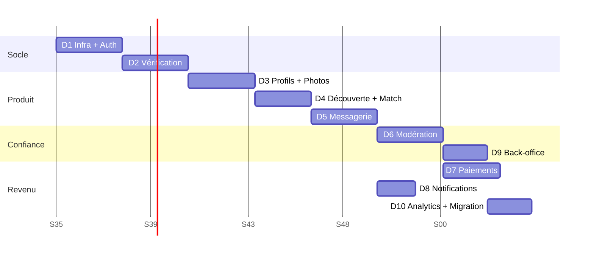

# 08 — Backlog MVP : user stories et critères d'acceptation

**Convention.** `ID` · priorité MoSCoW (**M**ust / **S**hould / **C**ould) · estimation en points (1, 2, 3, 5, 8, 13).
Une story n'est **terminée** que si : code livré, tests unitaires et d'intégration verts, test d'autorisation présent,
lint et typage sans erreur, documentation à jour.

Total MVP : **75 stories**, **414 points** (D5-10 ajoutée en cours de tranche D5). Vélocité supposée de 40 points par sprint de 2 semaines pour une équipe de
3 développeurs → **≈ 10 sprints, soit 5 mois** hors phase de conception. Cohérent avec le « 3 à 4 mois » du cahier
des charges à condition d'ajouter un quatrième développeur ou de retirer les lots D7 et D10 du périmètre initial.

---

## Lot D1 — Infrastructure et authentification (52 pts)

| ID    | Story                                                                                                                                         | Prio | Pts |
| ----- | --------------------------------------------------------------------------------------------------------------------------------------------- | :--: | :-: |
| D1-01 | En tant qu'équipe, je veux un monorepo démarrable en une commande, afin qu'un nouveau développeur soit productif en moins d'une heure         |  M   |  8  |
| D1-02 | En tant que visiteuse, je veux m'inscrire avec mon numéro de téléphone, afin d'accéder au service sans adresse e-mail                         |  M   |  5  |
| D1-03 | En tant que plateforme, je veux refuser toute inscription d'une personne mineure, afin de respecter l'exigence légale non négociable          |  M   |  5  |
| D1-04 | En tant qu'utilisateur, je veux recevoir et saisir un code OTP, afin de prouver que le numéro est le mien                                     |  M   |  5  |
| D1-05 | En tant qu'utilisateur, je veux ajouter un e-mail et un mot de passe, afin de disposer d'une seconde voie de connexion                        |  M   |  3  |
| D1-06 | En tant qu'utilisateur, je veux rester connecté sans me ré-authentifier chaque jour, afin d'utiliser l'application sans friction              |  M   |  5  |
| D1-07 | En tant qu'utilisateur, je veux voir mes appareils connectés et les déconnecter, afin de garder le contrôle de mon compte                     |  M   |  3  |
| D1-08 | En tant que plateforme, je veux limiter les tentatives d'authentification, afin de résister au brute force et à l'énumération                 |  M   |  5  |
| D1-09 | En tant qu'utilisateur ayant perdu l'accès, je veux récupérer mon compte de façon sécurisée, afin de ne pas le perdre définitivement          |  M   |  3  |
| D1-10 | En tant qu'équipe, je veux une gestion d'erreurs centralisée à codes stables, afin que les clients traitent les cas d'échec de façon uniforme |  M   |  3  |
| D1-11 | En tant qu'équipe, je veux une pipeline CI bloquante, afin qu'aucun code non testé n'atteigne la branche principale                           |  M   |  5  |
| D1-12 | En tant que plateforme, je veux empêcher la ré-inscription d'une identité bannie ou refusée pour minorité                                     |  M   |  2  |

### Critères d'acceptation — stories critiques

**D1-03 — Refus des mineurs**

- L'âge est calculé **côté serveur** à partir de `birthDate` et de l'horloge serveur ; une valeur d'âge envoyée par le client est ignorée.
- Un âge inférieur au minimum configuré → réponse 403 `AUTH_UNDERAGE`, compte créé au statut `BLOCKED_UNDERAGE`, `BlockedIdentity` écrit avec l'empreinte du numéro.
- Le compte `BLOCKED_UNDERAGE` ne peut **jamais** être réactivé, y compris par un `SUPER_ADMIN`.
- Une nouvelle inscription avec le même numéro est refusée avec un message neutre qui ne révèle pas le motif.
- La date exacte de bascule (anniversaire du jour) est couverte par un test aux limites, en UTC.

**D1-06 — Sessions et rotation de tokens**

- L'access token expire en 15 minutes ; le refresh token en 30 jours.
- Le refresh token est stocké **haché** ; il est à usage unique et remplacé à chaque appel.
- La présentation d'un refresh token déjà consommé révoque **toute la famille**, écrit un audit et déclenche une notification de sécurité.
- « Déconnecter tous les appareils » révoque toutes les sessions en une seule transaction.

**D1-08 — Limitation des tentatives**

- Limite par IP, par compte et par appareil, avec verrouillage progressif (1 min, 5 min, 30 min).
- La réponse à une tentative sur un compte inexistant est **indiscernable** (message et temps de réponse) de celle sur un compte existant.
- Les compteurs sont dans Redis et survivent au redémarrage de l'API.

---

## Lot D2 — Majorité et vérification d'identité (47 pts)

| ID    | Story                                                                                                                               | Prio | Pts |
| ----- | ----------------------------------------------------------------------------------------------------------------------------------- | :--: | :-: |
| D2-01 | En tant que membre, je veux envoyer ma pièce d'identité et un selfie, afin d'obtenir le badge vérifié                               |  M   |  8  |
| D2-02 | En tant que plateforme, je veux une machine à états de vérification à 7 statuts, afin de couvrir tous les cas de traitement         |  M   |  5  |
| D2-03 | En tant qu'agent, je veux une file de vérification triée par ancienneté, afin de traiter les demandes dans l'ordre                  |  M   |  5  |
| D2-04 | En tant qu'agent, je veux approuver, rejeter ou demander un complément avec un motif normalisé                                      |  M   |  5  |
| D2-05 | En tant que plateforme, je veux stocker les documents dans un espace séparé et chiffré, afin de protéger la donnée la plus sensible |  M   |  8  |
| D2-06 | En tant que plateforme, je veux purger automatiquement les documents au terme de la durée configurée                                |  M   |  5  |
| D2-07 | En tant que membre vérifié, je veux que ma date de naissance devienne non modifiable                                                |  M   |  2  |
| D2-08 | En tant qu'équipe, je veux un adaptateur KYC simulé remplaçable sans toucher au métier                                              |  M   |  5  |
| D2-09 | En tant que responsable, je veux qu'une re-vérification puisse être exigée à tout moment                                            |  S   |  2  |
| D2-10 | En tant qu'auditeur, je veux que chaque consultation de document soit journalisée nominativement avec motif                         |  M   |  2  |

### Critères d'acceptation — stories critiques

**D2-05 — Séparation et protection des documents**

- Les documents sont écrits dans un bucket distinct du bucket média, avec une politique et une clé distinctes.
- Aucune route publique ne retourne jamais une URL de document.
- L'accès agent produit une URL signée de **5 minutes maximum**, après saisie d'un motif d'au moins 10 caractères.
- Les tables `kyc.*` sont inaccessibles au rôle PostgreSQL du produit — vérifié par un test d'intégration qui tente la lecture et attend un refus.
- Aucun champ de document n'apparaît dans les logs : un test injecte un document et vérifie l'absence de toute clé de stockage dans la sortie de journalisation.

**D2-08 — Adaptateur KYC**

- L'interface `KycProvider` est définie dans `application/ports`, sans aucune référence à un fournisseur.
- `MockKycProvider` est sélectionné par `KYC_PROVIDER=mock` et journalise un avertissement à chaque démarrage.
- Le remplacement par une implémentation réelle ne modifie **aucun** fichier de `domain/` ni d'`application/` — vérifié en revue et documenté dans `MOCKS.md`.
- En production avec un port critique simulé, l'API refuse de démarrer sauf autorisation explicite par variable d'environnement.

---

## Lot D3 — Profils et photos (55 pts)

| ID    | Story                                                                                                             | Prio | Pts |
| ----- | ----------------------------------------------------------------------------------------------------------------- | :--: | :-: |
| D3-01 | En tant que membre, je veux créer mon profil par étapes courtes avec enregistrement automatique                   |  M   |  8  |
| D3-02 | En tant que membre, je veux voir mon taux de complétion et ce qu'il me reste à faire                              |  M   |  3  |
| D3-03 | En tant que membre, je veux ajouter de 3 à 6 photos et les réordonner                                             |  M   |  5  |
| D3-04 | En tant que plateforme, je veux traiter chaque image (type réel, EXIF, compression, miniatures) avant publication |  M   |  8  |
| D3-05 | En tant que modérateur, je veux une file de modération photo en mode rapide                                       |  M   |  5  |
| D3-06 | En tant que membre, je veux être prévenu du refus d'une photo avec un motif compréhensible                        |  M   |  3  |
| D3-07 | En tant que membre, je veux définir mes critères de recherche                                                     |  M   |  5  |
| D3-08 | En tant que membre, je veux mettre mon profil en pause ou le désactiver                                           |  M   |  3  |
| D3-09 | En tant que plateforme, je veux servir tout média par URL signée de courte durée                                  |  M   |  5  |
| D3-10 | En tant que membre, je veux un référentiel de villes et d'intérêts cohérent plutôt qu'une saisie libre            |  M   |  5  |
| D3-11 | En tant que plateforme, je veux détecter la même photo utilisée sur plusieurs comptes                             |  S   |  5  |

**D3-04 — Pipeline média**

- Le type réel est déterminé par **signature binaire** ; un fichier renommé en `.jpg` est refusé.
- Toutes les métadonnées EXIF sont supprimées — un test vérifie l'absence de coordonnées GPS dans le fichier produit.
- L'image est ré-encodée (défense contre les charges utiles embarquées) et trois miniatures sont générées.
- Un fichier dépassant la taille ou les dimensions autorisées est rejeté **avant** écriture sur le stockage.
- La photo n'est visible d'autrui qu'après passage au statut `APPROVED`.

---

## Lot D4 — Découverte et matching (48 pts)

| ID    | Story                                                                                  | Prio | Pts |
| ----- | -------------------------------------------------------------------------------------- | :--: | :-: |
| D4-01 | En tant que membre vérifié, je veux recevoir des suggestions quotidiennes pertinentes  |  M   | 13  |
| D4-02 | En tant que plateforme, je veux exclure tout profil non éligible des suggestions       |  M   |  8  |
| D4-03 | En tant que membre, je veux envoyer un intérêt ou passer un profil                     |  M   |  3  |
| D4-04 | En tant que membre, je veux qu'un intérêt réciproque crée un match et une conversation |  M   |  5  |
| D4-05 | En tant que membre, je veux consulter mes intérêts envoyés et reçus                    |  M   |  5  |
| D4-06 | En tant que membre, je veux bloquer quelqu'un et disparaître de sa vue immédiatement   |  M   |  5  |
| D4-07 | En tant que membre, je veux annuler un match                                           |  M   |  3  |
| D4-08 | En tant que plateforme, je veux un quota quotidien appliqué côté serveur               |  M   |  3  |
| D4-09 | En tant que membre Premium, je veux des filtres avancés derrière un feature flag       |  S   |  3  |

**D4-02 — Exclusions (la story la plus critique du lot)**

- Aucune suggestion ne contient un profil : mineur, non vérifié, non actif, incomplet, sans photo approuvée, bloqué dans un sens ou l'autre, déjà vu, déjà décidé, déjà en match, hors préférences réciproques, ou soi-même.
- Chacune des 13 exclusions fait l'objet d'un test unitaire dédié **et** d'un test d'intégration sur données réelles.
- Les filtres sont appliqués en SQL, jamais après récupération en mémoire.
- Un profil suspendu à l'instant T disparaît des suggestions en cache en moins de 60 secondes.

**D4-04 — Création du match**

- La création `Like` → détection de réciprocité → `Match` → `Conversation` → 2 `ConversationMember` → message système se fait dans **une seule transaction**.
- Un échec à n'importe quelle étape annule tout : il ne peut exister ni match sans conversation, ni conversation sans match — vérifié par un test d'intégration avec injection d'erreur.
- L'ordre `userAId < userBId` est garanti quel que soit qui a envoyé l'intérêt en premier.
- Les deux membres reçoivent une notification `NEW_MATCH` et un événement Socket.IO `match:new`.

---

## Lot D5 — Messagerie (52 pts)

| ID    | Story                                                                                  | Prio | Pts |
| ----- | -------------------------------------------------------------------------------------- | :--: | :-: |
| D5-01 | En tant que membre matché, je veux échanger des messages en temps réel                 |  M   | 13  |
| D5-02 | En tant que plateforme, je veux rendre impossible tout message sans match mutuel actif |  M   |  8  |
| D5-03 | En tant que membre, je veux voir les statuts envoyé, livré et lu                       |  M   |  5  |
| D5-04 | En tant que membre, je veux charger l'historique par pagination fluide                 |  M   |  5  |
| D5-05 | En tant que membre, je veux envoyer une image modérée avant affichage                  |  S   |  5  |
| D5-06 | En tant que membre, je veux signaler ou bloquer depuis la conversation                 |  M   |  3  |
| D5-07 | En tant que plateforme, je veux limiter les messages sans réponse                      |  M   |  3  |
| D5-08 | En tant que membre, je veux supprimer un de mes messages                               |  S   |  3  |
| D5-09 | En tant que membre en réseau instable, je veux que mes envois ne se dupliquent pas     |  M   |  5  |
| D5-10 | En tant que membre, je veux savoir qu'un message a été _reçu_ avant d'être lu          |  S   |  2  |

_Le lot passe de 50 à 52 points : D5-10 a été isolée en cours d'implémentation plutôt que laissée implicite dans D5-03._

**D5-02 — La règle centrale du produit**

- L'envoi est refusé si : pas de match, match `UNMATCHED`, conversation verrouillée, blocage dans un sens ou l'autre, compte non actif, compte non vérifié. Codes détaillés dans docs/05-api.md §6.
- La règle est appliquée par un **garde unique**, partagé entre la route HTTP et l'événement Socket.IO — les deux canaux passent par la même instance de `ConversationAccessService`.
- Aucune route de l'API ne permet d'écrire à un membre par son identifiant : test d'inventaire des routes.
- Un blocage verrouille la conversation en moins d'une seconde et émet `conversation:locked` aux deux membres.

### État de livraison du lot D5

| Story | État       | Précision                                                                                                                                                                      |
| ----- | ---------- | ------------------------------------------------------------------------------------------------------------------------------------------------------------------------------ |
| D5-01 | ✅ livré   | Passerelle Socket.IO `/ws`, jeton vérifié à la connexion, adhésion relue en base à chaque événement.                                                                           |
| D5-02 | ✅ livré   | Règle en fonction pure, service d'accès unique, garde HTTP + canal temps réel, test d'inventaire des routes.                                                                   |
| D5-03 | ✅ livré   | `SENT → DELIVERED → READ`, sans régression possible ; accusé émis uniquement sur changement réel.                                                                              |
| D5-04 | ✅ livré   | Curseur opaque `(createdAt, id)` sur l'index composite, aucun `OFFSET`.                                                                                                        |
| D5-05 | ✅ livré   | Même chaîne image que les photos de profil ; aucune URL livrée avant approbation.                                                                                              |
| D5-06 | 🟨 partiel | **Bloquer** depuis la conversation fonctionne (`POST /blocks`, livré en D4). **Signaler** un message dépend de `POST /reports`, livré en D6-01 : la route n'existe pas encore. |
| D5-07 | ✅ livré   | Série consécutive sans réponse, remise à zéro dès que l'autre membre écrit.                                                                                                    |
| D5-08 | ✅ livré   | Suppression logique : corps effacé, ligne conservée pour la modération.                                                                                                        |
| D5-09 | ✅ livré   | Contrainte unique `(senderId, clientIdempotencyKey)` comme arbitre ; la ré-émission ne rediffuse pas.                                                                          |

**Reporté explicitement (D5-10)** : la remise `DELIVERED`, distincte de `SENT`, n'est pas encore émise à la
réception par le socket du destinataire — un message passe aujourd'hui de `SENT` à `READ`. La colonne, la
transition et le test existent déjà (`advanceDeliveryStatus`) ; il manque l'accusé émis par le client à la
réception. Rien dans l'interface ne doit afficher « livré » tant que cette story n'est pas faite.

---

## Lot D6 — Sécurité et modération (58 pts)

| ID    | Story                                                                                                            | Prio | Pts |
| ----- | ---------------------------------------------------------------------------------------------------------------- | :--: | :-: |
| D6-01 | En tant que membre, je veux signaler un profil, une photo, un message ou un comportement en moins de 20 secondes |  M   |  5  |
| D6-02 | En tant que plateforme, je veux regrouper les signalements en cas et calculer une priorité et une échéance       |  M   |  8  |
| D6-03 | En tant que modérateur, je veux une file triée par priorité et ancienneté avec compte à rebours SLA              |  M   |  8  |
| D6-04 | En tant que modérateur, je veux m'attribuer un cas et voir tout l'historique du membre                           |  M   |  5  |
| D6-05 | En tant que modérateur, je veux appliquer l'une des 10 actions avec motif normalisé                              |  M   |  8  |
| D6-06 | En tant que responsable, je veux qu'un bannissement définitif exige un second valideur                           |  M   |  3  |
| D6-07 | En tant que plateforme, je veux détecter 9 schémas de comportement suspect par règles                            |  M   | 13  |
| D6-08 | En tant que plateforme, je veux ne jamais appliquer automatiquement de sanction irréversible                     |  M   |  3  |
| D6-09 | En tant que membre signalé, je veux être informé de la décision me concernant                                    |  S   |  3  |
| D6-10 | En tant que responsable, je veux mesurer le délai de traitement et être alerté des dépassements                  |  M   |  2  |

**D6-07 — Détection par règles**

- Les 9 règles sont implémentées : demandes répétées d'argent (motifs textuels + fréquence), messages similaires en masse, créations répétées de comptes (empreinte d'appareil), changements fréquents d'appareil, volume anormal de likes, refus répété de vérification, signalements multiples, liens suspects, comportement automatisé (cadence inhumaine).
- Chaque règle est une fonction pure testable, avec ses seuils **en configuration**, jamais codés en dur.
- Une règle produit un `ModerationSignal` et **au plus** une mesure réversible ; elle ne peut ni suspendre ni bannir.
- Un tableau de bord affiche le taux de faux positifs par règle, mesuré sur les cas classés sans suite.

### État de livraison du lot D6

| Story | État       | Précision                                                                                                                                          |
| ----- | ---------- | -------------------------------------------------------------------------------------------------------------------------------------------------- |
| D6-01 | ✅ livré   | Une seule requête, aucun champ obligatoire hors catégorie, `AUTH` et non `VERIFIED`.                                                               |
| D6-02 | ✅ livré   | Priorité par catégorie, montée irréversible, échéance recomptée depuis l'ouverture, réouverture d'un cas résolu récent.                            |
| D6-03 | ✅ livré   | File triée priorité puis ancienneté, état SLA `ON_TIME` / `DUE_SOON` / `OVERDUE` proportionnel à la fenêtre.                                       |
| D6-04 | ✅ livré   | Attribution exclusive, dossier complet avec antécédents tous cas confondus, consultation auditée.                                                  |
| D6-05 | ✅ livré   | Les 10 actions, motif obligatoire, effets sur compte et contenu via des ports implémentés par les modules propriétaires.                           |
| D6-06 | ✅ livré   | `BAN` exige `users.ban`, un second valideur **distinct**, et bloque l'identité par empreintes (ADR-013).                                           |
| D6-07 | ✅ livré   | 9 règles pures, seuils entièrement en configuration, garde-fou qui refuse toute mesure non réversible.                                             |
| D6-08 | ✅ livré   | Vérifié à trois niveaux : liste blanche d'actions automatisables, contrôle dans `checkAction`, test qui déclenche les 9 règles à la fois.          |
| D6-09 | 🟨 partiel | La notification in-app est **écrite en base** ; aucun envoi push ni e-mail — file multi-canal en D8.                                               |
| D6-10 | 🟨 partiel | `GET /admin/moderation/metrics` livre volumétrie, retards et délai **médian**. L'**alerte** sur dépassement suppose la file de notifications (D8). |

**Non fait, dit explicitement :**

- **Le tableau de bord des faux positifs par règle** (dernier point de D6-07) n'existe pas. Les données pour le
  produire sont là — chaque `ModerationSignal` est rattaché à un cas dont l'issue est connue — mais l'écran est
  du back-office, donc D9. Aucune règle ne doit être resserrée avant cette mesure.
- **La levée automatique d'une sanction à échéance** : voir `docs/MOCKS.md`, réserve 3.
- **Le verrou append-only du journal d'audit** est applicatif, pas structurel : `TODO(D9-07)`.

---

## Lot D7 — Abonnements et paiements (45 pts)

| ID    | Story                                                                                                  | Prio | Pts |
| ----- | ------------------------------------------------------------------------------------------------------ | :--: | :-: |
| D7-01 | En tant qu'équipe, je veux une abstraction `PaymentProvider` avec implémentation simulée « Mode test » |  M   |  8  |
| D7-02 | En tant que membre, je veux souscrire un abonnement mensuel, trimestriel ou annuel                     |  M   |  8  |
| D7-03 | En tant que membre, je veux payer par mobile money                                                     |  M   |  5  |
| D7-04 | En tant que plateforme, je veux traiter les webhooks de façon vérifiée et idempotente                  |  M   |  8  |
| D7-05 | En tant que membre, je veux consulter mon historique et mes reçus                                      |  M   |  5  |
| D7-06 | En tant que membre, je veux annuler mon renouvellement                                                 |  M   |  3  |
| D7-07 | En tant que plateforme, je veux gérer l'échec de paiement avec période de grâce                        |  M   |  5  |
| D7-08 | En tant qu'administrateur, je veux rembourser avec un second valideur                                  |  S   |  3  |

**D7-04 — Idempotence des webhooks**

- La signature est vérifiée **avant** toute lecture du corps ; une signature invalide renvoie 401 sans traitement.
- L'événement est persisté avec la contrainte unique `(provider, providerEventId)` puis la réponse 200 est envoyée immédiatement.
- Le traitement asynchrone utilise un `jobId` déterministe ; **rejouer 10 fois le même événement produit exactement un crédit d'abonnement** — c'est le test E2E n° 14.
- Un événement en échec est rejouable depuis le back-office sans effet de bord.

### État de livraison du lot D7

| Story | État       | Précision                                                                                                                                        |
| ----- | ---------- | ------------------------------------------------------------------------------------------------------------------------------------------------ |
| D7-01 | ✅ livré   | `MockPaymentProvider` : `testMode` serveur, signature **toujours refusée**, références préfixées `mock_`.                                        |
| D7-02 | ✅ livré   | Souscription mensuelle, trimestrielle, annuelle ; renouvellement anticipé empilé sur le reliquat.                                                |
| D7-03 | ✅ livré   | Mobile money : seuls l'opérateur et les 4 derniers chiffres sont conservés.                                                                      |
| D7-04 | ✅ livré   | Signature avant lecture, unicité `(provider, providerEventId)`, transition conditionnée à l'état courant. **Rejeu ×10 → un seul crédit**, testé. |
| D7-05 | 🟨 partiel | Historique paginé avec numéro de reçu livré. **Le reçu PDF n'existe pas** — voir ci-dessous.                                                     |
| D7-06 | ✅ livré   | Annulation = drapeau, jamais coupure : les droits courent jusqu'à l'échéance.                                                                    |
| D7-07 | ✅ livré   | Période de grâce configurable ; les droits restent ouverts pendant la grâce.                                                                     |
| D7-08 | ✅ livré   | Remboursement total ou partiel, second valideur **distinct** obligatoire, appel fournisseur seulement après validation.                          |

**Non fait, dit explicitement :**

- **Le reçu PDF de D7-05.** Le numéro de reçu est attribué (`ACUBA-AAAAMM-NNNNNN`) et l'historique l'expose, mais
  `GET /payments/{id}/receipt` ne rend aucun PDF : la génération de document est un travail à part entière, et
  produire un justificatif comptable faux serait pire que ne pas en produire. Reporté en `TODO(D9-05)`.
- **La clôture automatique des périodes de grâce.** La règle et le cas d'usage existent et sont testés ; le
  déclenchement passe aujourd'hui par `POST /admin/subscriptions/expire-grace`. La tâche planifiée est en D8.
- **L'encaissement réel** : voir la réserve dédiée dans `docs/MOCKS.md`. Tant que `PAYMENT_PROVIDER=mock`,
  aucun webhook n'est authentifiable, donc aucun crédit ne peut arriver de l'extérieur.

---

## Lot D8 — Notifications (30 pts)

| ID    | Story                                                                                   | Prio | Pts |
| ----- | --------------------------------------------------------------------------------------- | :--: | :-: |
| D8-01 | En tant qu'équipe, je veux une file de notifications multi-canal avec réessais          |  M   |  8  |
| D8-02 | En tant que membre, je veux être notifié des 8 déclencheurs MVP                         |  M   |  8  |
| D8-03 | En tant que membre, je veux gérer mes préférences par type et par canal                 |  M   |  5  |
| D8-04 | En tant que plateforme, je veux empêcher la désactivation des notifications de sécurité |  M   |  3  |
| D8-05 | En tant que membre, je veux un centre de notifications in-app                           |  M   |  3  |
| D8-06 | En tant que plateforme, je veux ne jamais envoyer deux fois la même notification        |  M   |  3  |

**D8-04 — Notifications non désactivables**

- Les types `OTP_CODE`, `SECURITY_ALERT`, `VERIFICATION_*`, `MODERATION_ACTION` sont refusés côté **serveur** en cas de tentative de désactivation (403 `NOTIF_MANDATORY_TYPE`).
- L'interface les affiche verrouillés avec explication, mais l'interface n'est pas le contrôle : un appel direct à l'API est également refusé — c'est ce qui est testé.

### État de livraison du lot D8

| Story | État       | Précision                                                                                                                                                                                                                  |
| ----- | ---------- | -------------------------------------------------------------------------------------------------------------------------------------------------------------------------------------------------------------------------- |
| D8-01 | 🟨 partiel | File BullMQ réelle, `jobId` déterministe, réessais pilotés par le domaine. **Mais aucun canal sortant n'aboutit** : push et e-mail sont simulés.                                                                           |
| D8-02 | ✅ livré   | Les 8 déclencheurs sont définis, avec leurs canaux par défaut. Un test verrouille le compte et la couverture.                                                                                                              |
| D8-03 | ✅ livré   | Grille complète rendue, y compris les combinaisons jamais enregistrées.                                                                                                                                                    |
| D8-04 | ✅ livré   | 6 types verrouillés. Le refus est **côté serveur** : `resolveChannels` ignore la préférence, et `PUT /preferences` renvoie 403 `NOTIF_MANDATORY_TYPE`. Toute la mise à jour est rejetée si une seule entrée est interdite. |
| D8-05 | ✅ livré   | Centre in-app paginé par curseur, compte de non-lues, marquage unitaire et global.                                                                                                                                         |
| D8-06 | ✅ livré   | Contrainte unique `(userId, dedupeKey)`. Les messages d'une même conversation sont regroupés par heure.                                                                                                                    |

**Deux décisions produit qui méritent d'être connues :**

- **Le SMS n'est utilisé que pour l'OTP.** Canal coûteux sur les marchés visés : l'utiliser pour des notifications
  d'usage reviendrait à faire payer le membre pour du marketing.
- **Une notification par message serait insupportable.** Les messages d'une même conversation sont regroupés par
  tranche horaire : un membre reçoit au plus une notification par conversation et par heure. Sans cela, il coupe le
  canal — y compris pour ce qui compte.

**Non fait, dit explicitement :**

- **Aucun push ni e-mail ne part réellement** : voir `docs/MOCKS.md`. Le canal in-app, lui, fonctionne.
- **Les deux tâches planifiées attendues** — clôture des périodes de grâce (D7) et levée des sanctions temporaires
  à échéance (D6) — **ne sont pas livrées**. La file existe, les tâches qui l'utiliseraient non : elles ne font
  partie d'aucune des six stories D8, et les ajouter pour pouvoir annoncer une réserve levée aurait été un
  affichage. Elles restent déclenchables manuellement par leurs routes d'administration.

---

## Lot D9 — Back-office (40 pts)

| ID    | Story                                                                                         | Prio | Pts |
| ----- | --------------------------------------------------------------------------------------------- | :--: | :-: |
| D9-01 | En tant qu'administrateur, je veux un back-office séparé avec 2FA obligatoire                 |  M   |  8  |
| D9-02 | En tant qu'administrateur, je veux un tableau de bord des 10 indicateurs clés                 |  M   |  8  |
| D9-03 | En tant qu'administrateur, je veux rechercher et consulter un compte avec tout son historique |  M   |  5  |
| D9-04 | En tant qu'administrateur, je veux suspendre, bannir ou lever une sanction                    |  M   |  5  |
| D9-05 | En tant qu'administrateur, je veux gérer les contenus (CGU, charte, modèles)                  |  S   |  5  |
| D9-06 | En tant qu'administrateur, je veux gérer les offres et consulter les transactions             |  S   |  3  |
| D9-07 | En tant qu'auditeur, je veux consulter un journal d'audit inaltérable                         |  M   |  3  |
| D9-08 | En tant que super administrateur, je veux gérer les rôles et les feature flags                |  M   |  3  |

**D9-07 — Journal d'audit**

- Toute action sensible écrit un `AdminAuditLog` **dans la même transaction** que l'action : si l'audit échoue, l'action est annulée.
- Aucune route d'écriture, de modification ou de suppression sur ce journal n'existe — test d'inventaire.
- Le rôle PostgreSQL applicatif n'a ni `UPDATE` ni `DELETE` sur la table — test d'intégration qui tente et attend un refus.

### État de livraison du lot D9

| Story | État             | Précision                                                                                                                                                                                                                                                   |
| ----- | ---------------- | ----------------------------------------------------------------------------------------------------------------------------------------------------------------------------------------------------------------------------------------------------------- |
| D9-01 | 🟨 partiel       | TOTP livré et **vérifié contre les vecteurs normatifs de la RFC 4226**, enrôlement en deux temps, secret rendu une seule fois. **Le back-office n'est pas un domaine séparé** et la 2FA n'est pas encore exigée à l'ouverture de session — voir ci-dessous. |
| D9-02 | ✅ livré         | Les 10 indicateurs, en agrégats seulement : aucun membre n'y est nommé.                                                                                                                                                                                     |
| D9-03 | ✅ livré         | Recherche par empreinte de numéro, dossier complet, **toute consultation auditée**.                                                                                                                                                                         |
| D9-04 | ✅ livré en D6   | Les routes de sanction vivent dans le module `moderation`, avec leurs garde-fous (quatre yeux sur le bannissement). Les dupliquer ici aurait créé un second chemin moins contrôlé.                                                                          |
| D9-05 | ⬜ **non livré** | La gestion de contenu (CGU, charte, modèles) exige une table versionnée qui n'existe pas au modèle de données. Priorité `S`.                                                                                                                                |
| D9-06 | 🟨 partiel       | Consultation des transactions livrée en D7 (`GET /payments`, `/admin/payments/…`). **L'édition des offres et des prix n'est pas livrée** : modifier un prix en production sans double validation ni historique serait imprudent.                            |
| D9-07 | ✅ livré         | Migration `audit_append_only` : déclencheur PostgreSQL refusant `UPDATE`/`DELETE` **et** retrait des droits au rôle applicatif. L'écriture d'audit n'est plus tolérante à l'échec.                                                                          |
| D9-08 | ✅ livré         | Rôles et feature flags, avec deux garde-fous : on ne modifie pas ses propres rôles, on ne retire pas le dernier super-administrateur.                                                                                                                       |

**Correction d'une décision de D6.** L'écriture d'audit y attrapait ses erreurs et poursuivait, au motif qu'une
sanction légitime ne devait pas échouer faute de trace. Le raisonnement était faux et D9-07 tranche dans l'autre
sens : une action sensible sans trace est exactement ce qu'un abus produirait. **Si l'audit ne peut pas être écrit,
l'action n'a pas lieu.**

**Non fait, dit explicitement :**

- **Le back-office n'est pas une application séparée.** Les routes `/admin/*` vivent dans la même API, protégées
  par permission. Un domaine distinct (`admin.acuba.*`), une politique de cookies propre et un réseau restreint
  sont un travail d'infrastructure, pas de code applicatif — à traiter au déploiement.
- **La 2FA n'est pas encore EXIGÉE à l'ouverture de session.** L'enrôlement, la vérification et l'activation
  fonctionnent ; il manque le contrôle dans le parcours de connexion administrateur, qui suppose un type de session
  distinct. Reporté en `TODO(E-02)`.
- **D9-05 en entier**, et **l'édition des offres de D9-06**.

---

## Lot D10 — Analytics et migration WhatsApp (37 pts)

| ID     | Story                                                                                                        | Prio | Pts |
| ------ | ------------------------------------------------------------------------------------------------------------ | :--: | :-: |
| D10-01 | En tant que porteur de projet, je veux des liens de migration traçables par campagne                         |  M   |  8  |
| D10-02 | En tant que membre historique, je veux bénéficier de l'offre de lancement                                    |  M   |  5  |
| D10-03 | En tant que plateforme, je veux empêcher l'abus de l'offre de lancement                                      |  M   |  5  |
| D10-04 | En tant que porteur de projet, je veux mesurer le tunnel clic → inscription → vérification → profil complété |  M   |  8  |
| D10-05 | En tant qu'équipe, je veux collecter des événements produit pseudonymisés                                    |  M   |  5  |
| D10-06 | En tant que porteur de projet, je veux les 13 indicateurs du cahier des charges                              |  M   |  5  |
| D10-07 | En tant que membre, je veux parrainer avec mon propre code                                                   |  C   |  1  |

**D10-03 — Anti-abus de l'offre de lancement**

- Un bénéfice promotionnel au maximum par numéro vérifié **et** par identité KYC (empreinte de pièce).
- Le quota `maxUses` d'un code est vérifié en transaction — deux inscriptions simultanées ne peuvent pas dépasser le quota.
- Un code expiré, révoqué ou saturé est refusé sans révéler l'existence de la campagne.
- Un compte banni perd immédiatement son bénéfice promotionnel.

**D10-05 — Événements pseudonymisés**

- Les propriétés d'événement sont validées par un schéma déclaré ; **une propriété non déclarée est rejetée**, ce qui rend impossible l'entrée accidentelle d'une donnée nominative.
- `subjectHash` est un HMAC de l'identifiant avec un secret serveur : les cohortes restent calculables, la ré-identification ne l'est pas depuis les seules données analytiques.
- Aucun contenu de message, aucune photo, aucun numéro ne figure jamais dans un événement — test de liste noire de clés.

---

## Ordre d'exécution et dépendances

**Dépendances dures.** D2 exige D1 · D3 exige D2 (pas de profil publiable sans vérification) · D4 exige D3 ·
D5 exige D4 (pas de conversation sans match) · D6 exige D5 (modérer suppose du contenu) · D9 s'appuie sur D2 et D6.

**Ce qui peut être parallélisé.** D8 (notifications) dès la fin de D5. Le back-office de vérification (sous-ensemble de
D9) doit être livré **avec D2**, pas à la fin : sans lui, aucun compte ne peut être vérifié en développement.

**En cas de retard, ordre de sacrifice.** D10 → D7 (ouverture en gratuit) → filtres Premium de D4 → pièces jointes de
D5. Jamais D1, D2, D5-02, D6, ni la partie modération de D9.

---

## Registre des TODO

**Aucun TODO silencieux n'est autorisé dans le code.** Tout `TODO` doit référencer une story de ce backlog
(`// TODO(D7-03): ...`) ou une entrée du tableau ci-dessous, sinon la CI échoue (règle ESLint dédiée).

| Réf   | Sujet                                                  | Lot                          |
| ----- | ------------------------------------------------------ | ---------------------------- |
| BL-01 | Interface 2FA membre (architecture livrée en D1)       | V1                           |
| BL-02 | Vivacité KYC réelle (interface livrée en D2)           | V1                           |
| BL-03 | Intégration paiement réelle (abstraction livrée en D7) | V1                           |
| BL-04 | Passerelle SMS réelle (port livré en D1)               | **Avant ouverture publique** |
| BL-05 | Modération de contenu automatisée (port livré en D3)   | V1                           |
| BL-06 | Appels audio et vidéo                                  | V1                           |
| BL-07 | Groupes communautaires                                 | V1                           |
| BL-08 | Événements et billetterie                              | V1                           |
| BL-09 | Matching comportemental                                | V2                           |
| BL-10 | Internationalisation complète                          | V2                           |
