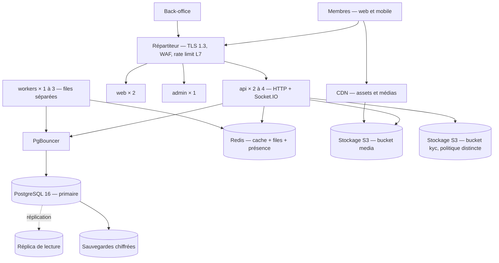

# 10 — Plan de déploiement et d'exploitation

---

## 1. Environnements

|                | `local`                             | `ci`                        | `staging` (recette)                             | `production`                                                |
| -------------- | ----------------------------------- | --------------------------- | ----------------------------------------------- | ----------------------------------------------------------- |
| Usage          | Développement                       | Tests automatisés           | Validation métier, charge                       | Service                                                     |
| Infrastructure | Docker Compose                      | Conteneurs éphémères        | Réduite, même topologie                         | Complète, redondée                                          |
| Données        | Seed anonyme                        | Base éphémère               | **Anonymisées** — jamais de copie de production | Réelles                                                     |
| Fournisseurs   | Tous simulés (MinIO, Mailpit réels) | Tous simulés, horloge figée | Bac à sable si disponible                       | Réels — **démarrage refusé si un port critique est simulé** |
| Accès          | Développeur                         | CI                          | Équipe + porteur de projet                      | Restreint, tracé                                            |
| Sauvegardes    | Aucune                              | Aucune                      | Hebdomadaire                                    | **Quotidienne chiffrée + restauration testée**              |

---

## 2. Développement local

```bash
git clone <dépôt> && cd a-chacun-une-belle-ame
cp .env.example .env          # aucune valeur réelle à l'intérieur
pnpm install
pnpm docker:up                # PostgreSQL, Redis, MinIO, Mailpit
pnpm db:migrate && pnpm db:seed
pnpm dev                      # api :3000 · web :3001 · admin :3002 · expo :8081
```

`docker-compose.yml` fournit :

| Service    | Image                | Port      | Rôle                                                         |
| ---------- | -------------------- | --------- | ------------------------------------------------------------ |
| `postgres` | `postgres:16-alpine` | 5432      | Base, schémas `app` et `kyc` créés au démarrage              |
| `redis`    | `redis:7-alpine`     | 6379      | Cache, files BullMQ, présence, rate limiting                 |
| `minio`    | `minio/minio`        | 9000/9001 | Stockage S3 local, **deux buckets séparés** `media` et `kyc` |
| `mailpit`  | `axllent/mailpit`    | 1025/8025 | E-mails de test, consultables dans le navigateur             |

Aucune clé réelle n'est nécessaire pour développer : tous les ports externes ont une implémentation simulée.

---

## 3. Construction et images

Trois images, chacune multi-étapes et sans dépendance de développement :

| Image         | Contenu                        | Point d'entrée                                                 |
| ------------- | ------------------------------ | -------------------------------------------------------------- |
| `acuba-api`   | NestJS compilé + client Prisma | `main.js` (API) ou `worker.js` (workers), selon `PROCESS_ROLE` |
| `acuba-web`   | Next.js en mode `standalone`   | `server.js`                                                    |
| `acuba-admin` | Next.js en mode `standalone`   | `server.js`                                                    |

Règles : utilisateur non-root · système de fichiers en lecture seule sauf `/tmp` · aucun secret dans l'image ·
image de base épinglée par empreinte · analyse de vulnérabilité de l'image bloquante en CI · étiquetage par
empreinte de commit (jamais `latest` en production).

**L'API et les workers partagent la même image** : même code, même version, deux rôles. Cela supprime la classe de
bugs « le worker tourne sur une version antérieure au code de l'API ».

---

## 4. Topologie de production



**Dimensionnement initial** (9 000 membres) : 2 API, 1 worker, PostgreSQL 4 vCPU / 8 Go, Redis 2 Go, 100 Go de
stockage média. **À x10** : 4 à 8 API, 3 workers par famille de file, réplica de lecture activé pour `discovery` et
`analytics`, Redis dédié aux files. Aucun changement de code n'est requis pour cette montée.

---

## 5. Secrets et configuration

**Aucun secret dans le dépôt, jamais.** `.env.example` liste toutes les clés attendues avec des valeurs vides ou
manifestement factices, et sert de documentation de configuration.

| Catégorie   | Variables                                                                                                                              |
| ----------- | -------------------------------------------------------------------------------------------------------------------------------------- |
| Base        | `DATABASE_URL`, `KYC_DATABASE_URL` (rôle distinct), `REDIS_URL`                                                                        |
| Jetons      | `JWT_PRIVATE_KEY`, `JWT_PUBLIC_KEY`, `ACCESS_TOKEN_TTL`, `REFRESH_TOKEN_TTL`                                                           |
| Chiffrement | `ENCRYPTION_KEY`, `ENCRYPTION_KEY_PREVIOUS` (rotation), `HASH_SALT`                                                                    |
| Stockage    | `S3_ENDPOINT`, `S3_MEDIA_BUCKET`, `S3_KYC_BUCKET`, clés d'accès distinctes par bucket                                                  |
| Ports       | `SMS_PROVIDER`, `KYC_PROVIDER`, `PAYMENT_PROVIDER`, `PUSH_PROVIDER`, `MAIL_PROVIDER`                                                   |
| Métier      | `MINIMUM_AGE`, `KYC_DOCUMENT_RETENTION_DAYS`, `MESSAGE_RETENTION_MONTHS`, `ACCOUNT_DELETION_GRACE_DAYS`, `DAILY_SUGGESTION_LIMIT_FREE` |
| Sécurité    | `CORS_ALLOWED_ORIGINS`, `RATE_LIMIT_*`, `ADMIN_SESSION_TTL`                                                                            |

**Validation au démarrage** par un schéma Zod : une variable manquante, mal typée ou hors bornes **empêche le
démarrage**. Une configuration invalide doit échouer bruyamment au lancement, jamais silencieusement à la première
requête d'un utilisateur.

**Garde-fou production** : si `NODE_ENV=production` et qu'un port critique est simulé, le démarrage échoue avec un
message explicite, sauf `ALLOW_MOCK_PROVIDERS_IN_PRODUCTION=true` posé délibérément.

---

## 6. Migrations de base

**Stratégie expand / contract** — jamais de migration destructive dans le même déploiement que le code qui la rend
nécessaire :

```
1. Expand   : ajouter la nouvelle colonne (nullable), déployer
2. Backfill : remplir par lots (worker), en double écriture
3. Switch   : le code lit la nouvelle colonne, déployer
4. Contract : supprimer l'ancienne colonne — déploiement séparé, après validation
```

- Migrations versionnées `prisma migrate`, nommées `NNNN_<tranche>_<objet>`.
- **Réversibilité** : un `down.sql` accompagne chaque migration lorsque c'est raisonnablement possible. Les cas non
  réversibles portent un avertissement en en-tête et exigent une sauvegarde préalable vérifiée.
- Application **avant** le démarrage des nouvelles instances, par un job dédié, jamais au lancement de l'API (deux
  instances démarrant simultanément ne doivent pas migrer en parallèle).
- Verrou consultatif PostgreSQL pour garantir l'exécution unique.
- Toute migration est jouée en recette sur un volume représentatif avant la production, avec sa durée mesurée.

---

## 7. Déploiement

| Étape | Action                                       | Critère de passage                                                     |
| ----- | -------------------------------------------- | ---------------------------------------------------------------------- |
| 1     | CI verte sur la branche principale           | Tous les jobs, dont les 18 E2E                                         |
| 2     | Construction et étiquetage des images        | Analyse de vulnérabilité sans alerte critique                          |
| 3     | Déploiement automatique en recette           | Santé verte, fumée E2E                                                 |
| 4     | Validation métier en recette                 | Accord du porteur de projet                                            |
| 5     | Sauvegarde de production **avant** migration | Sauvegarde vérifiée, pas seulement créée                               |
| 6     | Migration (job dédié)                        | Sortie sans erreur, durée conforme à la mesure de recette              |
| 7     | Déploiement progressif de l'API              | 1 instance, 10 min d'observation, puis le reste                        |
| 8     | Déploiement web et back-office               | Santé verte                                                            |
| 9     | Fumée en production                          | Inscription, connexion, suggestion, envoi de message (comptes de test) |
| 10    | Observation 30 min                           | Taux d'erreur, latence p95, profondeur des files stables               |

**Fenêtre recommandée :** mardi à jeudi, 10 h heure locale du marché principal — jamais un vendredi, jamais la nuit :
un incident doit trouver une équipe disponible et un support joignable.

---

## 8. Procédure de rollback

**Décider vite : au-delà de 10 minutes d'hésitation, on revient en arrière.** Un retour en arrière est peu coûteux ;
un incident prolongé sur une plateforme de confiance l'est beaucoup.

### Cas 1 — Code seul (aucune migration)

1. Redéployer l'étiquette précédente (procédure automatisée, ≤ 5 min).
2. Vérifier la santé et la fumée.
3. Consigner l'incident.

### Cas 2 — Code + migration additive (expand)

1. Redéployer le code précédent. La migration additive est **compatible** : la colonne ajoutée est simplement ignorée.
2. Aucune action sur la base.
3. Corriger, puis reprendre au déploiement suivant.

### Cas 3 — Code + migration destructive

1. **Ne pas** rejouer la migration à l'envers dans la précipitation.
2. Redéployer le code précédent **si** il reste compatible avec le schéma actuel.
3. Sinon : mode maintenance → restauration de la sauvegarde pré-migration → redéploiement du code précédent →
   validation d'intégrité → sortie de maintenance.
4. Post-mortem obligatoire : une migration destructive irrécupérable est un défaut de préparation, pas de chance.

### Cas 4 — Incident fonctionnel sans défaut de déploiement

Désactiver la fonction par **feature flag** — pas de redéploiement, effet immédiat. C'est la raison d'être des flags
(ADR-018) : ils transforment un rollback en interrupteur.

### Mode maintenance

Page statique servie par le répartiteur, message en français, durée annoncée. L'API répond 503 avec un code métier
stable. Les workers non concernés continuent (les purges et notifications ne doivent pas s'accumuler).

---

## 9. Sauvegardes et reprise

| Élément                      | Fréquence                  | Rétention                                                                                               | Chiffrement |
| ---------------------------- | -------------------------- | ------------------------------------------------------------------------------------------------------- | ----------- |
| PostgreSQL — complète        | Quotidienne                | 30 jours                                                                                                | ✅          |
| PostgreSQL — journaux (PITR) | Continu                    | 7 jours                                                                                                 | ✅          |
| Bucket média                 | Quotidienne (incrémentale) | 30 jours                                                                                                | ✅          |
| Bucket KYC                   | Quotidienne                | **Aligné sur la conservation des documents** — une sauvegarde ne doit pas ressusciter un document purgé | ✅          |
| Secrets                      | À chaque modification      | 90 jours                                                                                                | ✅          |

**Objectifs :** RPO ≤ 1 h (restauration au point dans le temps) · RTO ≤ 4 h.

**Exercice de restauration obligatoire tous les trimestres**, sur un environnement isolé, avec chronométrage et
compte rendu. Une sauvegarde jamais restaurée n'est pas une sauvegarde — c'est une hypothèse.

**Point de vigilance rarement traité :** la purge des documents d'identité doit se propager aux sauvegardes. La
rétention du bucket KYC est donc alignée sur la durée de conservation, et non sur la politique générale.

---

## 10. Observabilité et astreinte

| Alerte                                  | Seuil                              | Niveau |
| --------------------------------------- | ---------------------------------- | ------ |
| Taux d'erreur 5xx                       | > 1 % sur 5 min                    | S2     |
| Latence p95 API                         | > 1 s sur 10 min                   | S3     |
| Profondeur d'une file                   | > 1 000 ou plus vieux job > 15 min | S3     |
| Dead-letter non vide                    | ≥ 1                                | S3     |
| Cas de modération P0 non pris           | > 1 h                              | **S2** |
| Cas de modération en dépassement de SLA | > 5                                | S3     |
| Consultation de documents KYC           | > 20/h par compte                  | **S2** |
| Échec de sauvegarde                     | 1 occurrence                       | **S1** |
| Taux d'échec de paiement                | > 20 % sur 1 h                     | S3     |
| Espace disque base                      | > 80 %                             | S3     |
| Dépense SMS                             | > 80 % du plafond                  | S3     |

Astreinte : à définir avec le porteur de projet. **Au minimum, une personne joignable pour les alertes S1 pendant le
mois qui suit l'ouverture** — c'est la période où un incident non traité coûte le plus cher en réputation.

---

## 11. Ce qui doit exister avant la première mise en production

- [ ] Compte d'hébergement et région arrêtés (question Q12)
- [ ] Noms de domaine et certificats
- [ ] Gestionnaire de secrets configuré
- [ ] Contrat SMS actif (question Q4) — **sans lui, aucune inscription n'est possible**
- [ ] Sauvegardes automatiques **et** restauration testée
- [ ] Alertes configurées et acheminées vers une personne réelle
- [ ] Équipe de modération opérationnelle (question Q9)
- [ ] Checklist de sécurité de [`SECURITY.md`](../SECURITY.md) intégralement satisfaite
- [ ] Validation juridique obtenue (question Q5)
