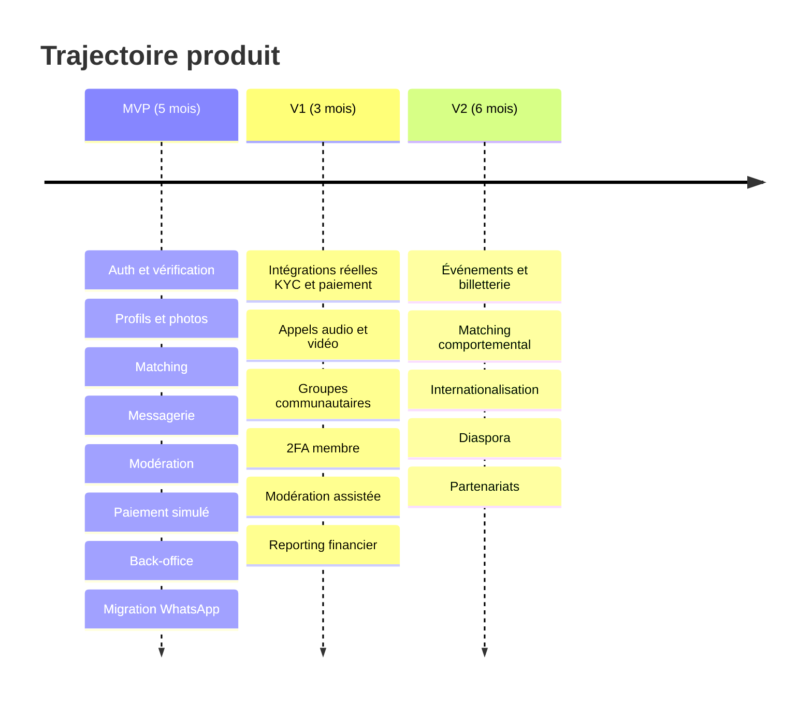

# 11 — Roadmap V1 et V2

Le MVP est décrit dans le [backlog](./08-backlog-mvp.md). Ce document couvre ce qui **n'est pas** développé
maintenant, avec ses dépendances — l'architecture les prépare, le code ne les implémente pas.

---

## 1. Vue d'ensemble

---

## 2. V1 — « Le produit devient réellement exploitable » (≈ 3 mois après le MVP)

Priorisée par ce qui débloque du revenu et de la confiance, pas par ce qui est le plus visible.

### V1.1 — Intégrations réelles ⭐ priorité absolue

| Élément                        | Dépendance      | Effort | Ce que ça débloque                                                    |
| ------------------------------ | --------------- | :----: | --------------------------------------------------------------------- |
| **Passerelle SMS réelle**      | Contrat (Q4)    |  3 j   | **L'ouverture publique elle-même** — rien ne fonctionne sans OTP réel |
| **Agrégateur mobile money**    | Contrat (Q3)    | 3 sem  | Tout le revenu                                                        |
| **Passerelle carte**           | Contrat         | 2 sem  | Diaspora, phase 2                                                     |
| **Prestataire KYC + vivacité** | Contrat (Q2)    | 3 sem  | Divise par 5 à 10 la charge de vérification manuelle                  |
| **Push FCM réel**              | Compte Firebase | 1 sem  | Rétention (la notification est le principal levier de retour)         |

**Toute l'abstraction est déjà livrée au MVP.** Chaque intégration consiste à écrire une implémentation de port et
à basculer une variable d'environnement — aucune modification du domaine ni de l'application. Les délais ci-dessus
sont dominés par les tests et la certification du prestataire, pas par le code.

### V1.2 — Appels audio et vidéo (6 à 8 semaines)

Explicitement demandé au cahier des charges (§4.5, §5.5), reporté au MVP par ADR délibéré.

- **Dépendances :** messagerie stable, serveurs TURN/STUN, budget de bande passante, politique de modération d'appel.
- **Contenu :** appel dans la conversation uniquement (jamais par numéro), **aucune divulgation du numéro réel**,
  consentement des deux parties, signalement pendant l'appel, durée journalisée sans contenu enregistré.
- **Point de vigilance :** un appel n'est pas modérable a posteriori. La réponse est le signalement en cours d'appel
  et la coupure immédiate, pas l'enregistrement — enregistrer les appels créerait un actif de données bien plus
  dangereux que le problème qu'il résout.

### V1.3 — Groupes communautaires (5 à 6 semaines)

Prolongement de l'esprit WhatsApp (§5.6).

- **Dépendances :** modération éprouvée (la surface de modération est multipliée), rôles de modérateur de groupe.
- **Contenu :** groupes par ville, tranche d'âge ou centre d'intérêt · fil modéré · charte par groupe · passerelle
  prioritaire pour les membres historiques.
- **Préparé au MVP :** le modèle de modération accepte déjà une cible générique ; il suffit d'ajouter le type
  `GROUP_POST`.
- **Avertissement :** un groupe est un espace où un escroc peut approcher plusieurs personnes d'un coup. À n'ouvrir
  qu'avec une capacité de modération démontrée sur trois mois.

### V1.4 — Compléments (2 à 3 semaines cumulées)

| Élément                               | Effort | Note                                            |
| ------------------------------------- | :----: | ----------------------------------------------- |
| 2FA membre (interface)                | 1 sem  | Schéma et endpoints déjà livrés au MVP          |
| Modération de contenu assistée        | 2 sem  | Port `ContentModerationProvider` déjà en place  |
| Reporting financier par formule       | 1 sem  | Nécessite un volume de transactions réel        |
| Re-vérification aléatoire automatisée |  3 j   | Règle planifiée, décision humaine               |
| Recherche par filtres (Premium)       | 1 sem  | Distincte des suggestions quotidiennes          |
| API WhatsApp Business                 | 2 sem  | Validation Meta longue — à lancer tôt si retenu |

---

## 3. V2 — « Le produit s'étend » (≈ 6 mois après la V1)

### V2.1 — Événements et billetterie (8 à 10 semaines)

Demandé au cahier des charges (§5.7). Le plus lourd des chantiers restants — et le plus dépendant du hors-logiciel.

- **Dépendances :** paiement réel opérationnel, logistique terrain, responsabilité juridique des rencontres physiques,
  assurance.
- **Contenu :** création d'événements, jauge et équilibre par genre, billetterie intégrée, rappels, retours après
  l'événement, gestion des annulations et remboursements.
- **Point de vigilance :** une rencontre physique organisée par la plateforme engage sa responsabilité d'une manière
  que la mise en relation en ligne n'engage pas. **Avis juridique indispensable avant tout développement.**

### V2.2 — Matching comportemental (6 à 8 semaines)

- **Dépendances :** au moins 6 mois de données réelles (vues, intérêts, matchs, conversations engagées) — impossible
  avant.
- **Approche recommandée :** conserver le score déterministe comme **socle**, et n'ajouter qu'un **facteur
  d'ajustement borné** (± 20 %) appris sur les signaux. Le score reste explicable ; on ne remplace pas une décision
  auditable par une boîte noire.
- **Exigences non négociables :** explicabilité conservée · contrôle d'équité mesuré (voir [04 §7](./04-algorithme-de-matching.md))
  · possibilité de revenir au score déterministe par feature flag · aucun critère sensible en entrée.

### V2.3 — Internationalisation et diaspora (4 à 6 semaines)

Multi-langue complet · multi-devise avec exposants corrects par devise (le socle est déjà là) · fuseaux horaires ·
adaptation des moyens de paiement · conformité par pays d'ouverture · gestion des tranches d'âge et usages locaux.

### V2.4 — Autres

Partenariats commerciaux et espace marque · programme d'ambassadeurs · profil enrichi (audio de présentation,
questions guidées) · badges de confiance progressifs (ancienneté, taux de réponse) · tableau de bord avancé de
modération avec prédiction de charge.

---

## 4. Ce qui restera volontairement hors périmètre

| Élément                                              | Raison                                                                               |
| ---------------------------------------------------- | ------------------------------------------------------------------------------------ |
| Chiffrement de bout en bout de la messagerie         | Incompatible avec la modération, qui est la promesse centrale du produit (ADR-008)   |
| Géolocalisation précise / distance en kilomètres     | Risque de traque physique disproportionné au bénéfice (ADR-011)                      |
| Balayage rapide de profils                           | Contraire au positionnement « relation sérieuse » (cahier des charges §3.4)          |
| Achat de visibilité illimitée                        | Le boost est borné ; laisser l'argent dominer le classement détruirait la pertinence |
| Import automatique de contacts                       | Interdit par principe : aucune donnée sans consentement explicite                    |
| Enregistrement des appels                            | Créerait un actif de données plus dangereux que le risque traité                     |
| Vérification par reconnaissance faciale propriétaire | Relève d'un prestataire spécialisé, pas d'une équipe produit                         |

---

## 5. Dépendances hors logiciel

Ces éléments ne dépendent pas de l'équipe technique et **conditionnent** le calendrier ci-dessus :

| Dépendance                       | Bloque                            | Délai typique                                |
| -------------------------------- | --------------------------------- | -------------------------------------------- |
| Contrat passerelle SMS           | **L'ouverture publique**          | 2 à 6 semaines                               |
| Contrat agrégateur mobile money  | Tout le revenu                    | 4 à 12 semaines (vérifications commerciales) |
| Contrat prestataire KYC          | Automatisation de la vérification | 4 à 8 semaines                               |
| Validation juridique (Q5)        | L'ouverture publique              | 3 à 8 semaines                               |
| Recrutement des modérateurs (Q9) | L'ouverture publique              | 2 à 6 semaines                               |
| Comptes Apple et Google          | Distribution mobile en magasin    | 1 à 4 semaines + revue                       |
| Étude de prix locale             | Grille tarifaire (Q8)             | 2 à 4 semaines                               |

**À lancer dès maintenant, en parallèle du développement.** Les contrats prestataires et la validation juridique sont
les chemins critiques réels du projet — pas le code. Un MVP terminé sans contrat SMS ne peut ouvrir à personne.
